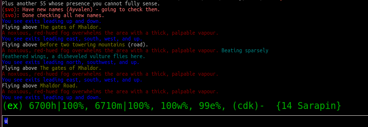
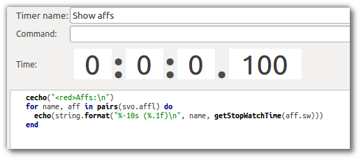

Svof |release| documentation
============================

Contents
--------

* :ref:`genindex`
* :ref:`search`

Basics of the system
--------------------

What is this system?
~~~~~~~~~~~~~~~~~~~~
This system is what was previously called Svo, which is no longer available. Svof is the free, open-source and community-supported version of Svo.

Installing
~~~~~~~~~~

To install the system, make sure GMCP is enabled (Mudlet settings), and that you're connected to server **achaea.com** and port **23**, and logged in -- then use the **vinstall** command. This'll have the system run auto-configuration first - where it'll detect and enable skills that you have. After that, it'll ask you preference questions about the basic and essential options. Feel free to take your time to ask someone else as to what should you set an option to (like for sipping health). The installation otherwise is fairly painless - and you can always change any option you'd like later with the same command.

After you've finished the installation, it's best to *vsave* and restart Mudlet so the system is loaded fresh with all the settings.

Enjoy!

:note: It is best not to do *CONFIG SCREENREADER ON* in the game - that will mess up Svof's tracking of prompt flags.

Using the system
~~~~~~~~~~~~~~~~
The system cures any ailments you get for you automatically - nothing needs to be turned on. Of course, the system won't cure if it's paused, but while it is, it'll still track all afflictions.

:note: you want to use the **dv** alias to have the system diagnose and **df** to check your defences. This will have the system both recognize the output, and also has the feature of the aliases being usable at any time - the system will do the action asap for you.

To pause or unpause the system, you can use the **pp** alias - using it alone will act as a toggle, but you can also do *pp on* and *pp off*. You no longer need to pause the system to sit or sleep, the system lets you do that

To enable anti-illusion in the system, you can do **tn ai** or **tn anti-illusion**. When you no longer need it, you can do **tf ai** (having anti-illusion on means the system will at times will do checks on afflictions before curing them; this is slower than just curing them right away).

If you're lagging a lot, and the system is double-doing actions because of that and etc, you can set the *vconfig lag #* option to help alleviate that. Do set it back to 0 when you're alright, though. You can also view what options have you currently set with *vconfig* and *vconfig2* aliases.

To get a better grasp of the system, I'd recommend that you participate in some combat arena events - free-for-alls, wargames, etc - so you'll have a little bit better idea of what to do when a real fight comes. You should also read up on the aeon/retardation curing and practice with the two modes of it in the arena - since it's something new and you'll want to at least have a basic idea of what's going on.

Make sure you don't do *config prompt none*, because the system does need to see your prompt stats!

That's about it! Do make sure that you have all the curatives necessary on you and you should be just fine. Take time to look through the available options and aliases as well to acquaint yourself with the system.

Differences to know if coming from vadi-m
~~~~~~~~~~~~~~~~~~~~~~~~~~~~~~~~~~~~~~~~~
Don't use Vadi Mapper anymore - the mudbot proxy isn't supported with Svof. Instead, use Mudlets Mapper - which is what I work on now. It doesn't have the community map making (and the free, often updated maps that magically came from out of nowhere), but that'll happen soon - plus it has awesome 3D and 2D viewing modes, allows for zooming, and has a ton of other features. For some people, it walks faster as well, and it doesn't cause a spam of blank lines like the Vadi Mapper does.

Besides, you'll come to love it:

  (Mudlet Clan): Mosr says, "I thought that I couldn't live without the mudbot mapper, but this tops it."

''ts'' has been changed to be a toggle for keepup, instead of a shield once asap measure. This means you'll want to ''ts'' again when you're doing alright.

''fl'' now has been upgraded to allow a command after it - like *fl write manuscript page 1* will write in the manuscript after it gets to full stats. This is also scriptable, you can have it execute your own function after it's done.

Svof is built into the client, so to interact with it, you'd use direct functions now, instead of ''send()'' as before: ::

   -- to pause:
   send("pp on")
   -- now becomes:
   svo.app("on")

   -- to use do:
   send("do kick rat")
   -- now becomes:
   svo.doadd("kick rat")

   -- to enable keepup
   svo.tntf_set("keepup", "on", true)
   -- to disable keepup
   svo.tntf_set("keepup", "off", true)

Unlike with vadi-m, it ''is'' possible for other scripts to interfere with Svof (whereas only enabling GMCP or MXP interfered with vadi-m - that is not the case here, it's fine now). Svof is much more customizable and flexible and that power leaves lots of room for messing up, unfortunately. Don't forget that you can now ignore afflictions, add/delete vconfig options, change balance states and etc.

Timestamp/XP in the prompt
^^^^^^^^^^^^^^^^^^^^^^^^^^^
This is no longer a separate option, but part of a bigger and a better feature - :ref:`custom prompts<customprompt>`. Here's a custom prompt which replicates the game's prompt exactly, but adds a timestamp: ::

   vconfig customprompt ^1@healthh, ^2@manam, ^5@endurancee, ^4@willpowerw ^W@eqbal@defs- @timestamp

To add your xp, you can use this - and of course you can re-arrange the tags as you'd like: ::

   vconfig customprompt ^1@healthh, ^2@manam, ^5@endurancee, ^4@willpowerw ^W@eqbal@defs @%xp- @timestamp

:note: Mudlet does have timestamps built-in that you can enable to show by pressing the blue (i) button bottom-right. This goes back in time as well, so you don't have to always keep it on.

Using defences
~~~~~~~~~~~~~~
The system organizes defences around defence modes, in which you can have it put up different defences. The process of putting them up is also in two stages: *defup* and *keepup*.

When you first switch to a defence mode using *vdefs <mode>*, defup will put up all of the defences that are on its list. Remember that you can tell defup to put up different defences in different modes - that is the difference in modes. After defup is done, the system will say *Ready for combat!*, and defup will be done - it'll care no more about your defences. Instead, keepup takes over. Keepups job, as the name implies, is to make sure its defences always stay up - if one goes down for any reason, it'll put it back up. Keepup can also be disabled or enabled for convenience with *tf keepup*, *tn keepup*.

To add/remove defences to defup or keepup, you can use *vdefup <defence>* and *vkeep <defence>* - or just click on the defences in the lists if you're using an updated version of Mudlet. You can also create new defence modes with *vcreate defmode <new mode name>*.

To view your current defup list, you can use **vshow defup**, and to view your current keepup list, **vshow keepup**. A green X by a defence means that it's on enabled, a deep blue m by a defence means that it's enabled, and the defence also has a small mana drain. A bright M by a defence means that it's enabled and has a large mana drain.

When you QQ, the system will automatically go into the *empty* defences mode - so precache doesn't take herbs back out that it puts away. When you log in, the system is in the *basic* defences mode - and so whatever you have on basic keepup will get put up right away.

:note: for metamorphs, Svof will ignore defences that it can't put up due to the low morph skill and complete defup without them.

:tip: if you'd like to cancel defup, you can do *vdefs cancel* to stop it. However, if you have something on keepup, keepup will then get it's defences up - so for an emergency altogether, see below.

:tip: if you'd like to stop keepup or defup from redeffing your defences all of a sudden, you can switch to the *empty* defences mode - *vdefs empty*! (provided you don't fill the empty defence mode with any defences)

:tip: for Occultists, the system will detect heartstone and simulacrum for you - making it safe to put it on defup/keepup.

:note: to set your Dragon breath type, summon it once manually - and the system will remember.

Adjusting defence menus
^^^^^^^^^^^^^^^^^^^^^^^
If you'd like to hide certain defences or groups from showing in the (huge) list, use the *vshow hidelist* alias and click on - or + beside defences, or even entire skillsets, to hide or show them.

Blocking
^^^^^^^^^^^^^^^^^^^^^^^^^^^^^^^
Svof has a very useful feature of 'block keepup' - using this, you can ask it to block a direction for you and it will reliably keep blocking: even if you move, or you get knocked off your horse (if you're blocking via Riding), or anything else. To use this, do **block <direction>** or **b <direction>**. To stop blocking, use **unblock** or **ub**.

Since the blocking is smart and won't spam blocking on an exit that isn't in the room, this means that you can also use it to **pre-block** - ask it to block a direction, move in, and it'll block for you ASAP. Should you have a better ping than a potential beckoner with a trigger on alertness, you'll win!

You can also disable the block keepup feature if you'd like to use the plain blocking instead - **vignore block** will do it.

Riding
^^^^^^^^^^^^^^^^^^^^^^^^^^^^^^^
Svof handles automatic mounting/vaulting for you. Firstly, it needs to know what skill and mount do you want to use - so mount or vault your steed manually, and it'll remember (ie "vault horse1324"). Then you can toggle 'va', or do 'va on', 'va off' to get up or down the horse. If you get knocked off the horse, Svof will automatically remount for you if va is on.

If you'd like Svof not to deal with riding for you at all, you can do *vignore riding*.

Selfishness
^^^^^^^^^^^^^^^^^^^^^^^^^^^^^^^
Keepup works in a special manner with selfishness - if it's off keepup, keepup will then do generosity for you. This allows you to use *vkeep selfishness* or *sl* to toggle selfishness - and if you have selfishness on while it's stripped from you, the system will automatically put it back up for you (note that you do not see generosity being done in blackout, so you could be forced to do it then). You can also use *sl on* and *sl off* to bypass the toggle.

If you'd like to disable this behavior, do *vignore selfishness*.

Lifevision & Shroud
^^^^^^^^^^^^^^^^^^^^^^^^^^^^^^^
Lifevision is included in the system! If you have it as a skill (lifevision, clarity or astralvision) - then you can vdefup or vkeep it. The system will then subsequently when lifevision detects an illusion and will ignore it as such.

If you have the lifevision artefact, then the system will realize that fact and enable it for defences as well. Though if yours is customized, then it won't realize that - you can turn it on with *vconfig havelifevision*.

The same goes with shrouding - if you've got yours as an artefact, it will automatically detect it. If yours is customized, that's not a problem, you can enable it with *vconfig haveshroud*.

Anti-illusion
~~~~~~~~~~~~~
Svof's anti-illusion is disabled by default, but is easily enabled with *tn a* or *tn anti-illusion*. You *must* enable anti-illusion when fighting anyone that can illusion - Serpents, Magi, Puppetry users, Dragons or people with the Staff of Illusion. Against serpents, you also ought to enable *sbites* and *stabs* - but read up on the *ignoresinglebites* option to know how that works, because that has it's own pitfalls.

To check whenever anti-illusion is on or off, look at *vshow*.

Anti-illusion has been getting modernized in recent updates, and will be more transparent about which illusions and catches and why - by including a non-intrusive, subtle yet visible blue (i) besides illusions. Hovering your mouse over it will give the reason as to why Svof ignored that illusion.

The AI is always improved and expanded upon - so if you notice an instance where it failed to do it's job, or could've done better - please provide feedback! You can also customize anti-illusion - check the :ref:`customizing-anti-illusion` section.

Using the *do / dofree* system
~~~~~~~~~~~~~~~~~~~~~~~~~~~~~~
The system includes a very nice feature to assist you in everyday tasks - the *do* queue. It allows you to queue actions (that take balance or equilibrium to do) to be done as soon as possible.

Using it is simple, the syntax is - ``do <action>``. If you already have both balance and equilibrium, then the system will do your action at once - otherwise, it'll do it as soon as you regain both balance and equilibrium. If you ask it to do multiple actions, then it'll do them properly, one action per balance/eq regain.

For example, if you'd like to do one thing after another, such as sketching runes on a person - you can just replace *send()* with :func:`svo.doadd` in your alias and they will be done properly one after another! ::

   svo.doadd("sketch rune A on "..matches[2])
   svo.doadd("sketch rune B on "..matches[2])
   svo.doadd("sketch rune C on "..matches[2])

If you'd like the system to do multiple actions _per_ one balance/eq regain - for example, your bashing attacks uses two arms instead of one balance - then you can use the **$** sign to separate commands - ie, ``do swing rat$swing rat`` will swing the rat twice at once. Or use it in an alias with your target: ::

   svo.dor("ucp "..target.."$ucp "..target.."$sdk "..target)

The really useful feature of do is the `dor` alias. It allows you to repeat an action indefinitely - does it on every balance/eq regain. To use it, you can use *dor <action>* to start it, and *dor* or *dor off* to disable it. For example, *dor kick rat* will kick the rat forever! This, as you might've noticed, is useful in bashing and an example **F2** keybinding is provided to show how to make use of it. You are responsible for using it, though - don't do anything that is against the rules of Achaea.

Note that you can also use your own aliases as actions - ie if your bashing alias is **dd**, then **dor dd** will work.

Other aliases provided with do are *dofirst*, *undo*, *undoall*, and *vshow do*.

Along with *do*, a *dofree* system is also provided - it's for actions that require balance/equilibrium, but don't take it. Aliases for it are similar - *dofree*, *dofreefirst/dff*, *undofree* and *undoallfree*.

You can use the *dop*, *dop on* and *dop off* to pause do/dofree, while not affecting the whole system.

Bashing triggers
~~~~~~~~~~~~~~~~
Svof comes with a ton of bashing triggers that are contributed by Drazik, Kard, Searnla, and many others. To enable them - do *tn bashing*, to check if you have them on - *vshow*, and to disable them, *tf bashing*.

Ignoring curing things
~~~~~~~~~~~~~~~~~~~~~~
*Svof* has a feature that allows you to ignore curing afflictions - this can come in handy handy in many situations; such as ignoring clumsiness for testing, ignoring an affliction that you get frequently while bashing but don't want to waste curatives on, or pausing curing a certain affliction to avoid a killing strat getting pulled of on you.

To view a list of all things you can ignore, you can use the ``vshow ignorelist`` alias. Warning, the list is big! While some afflictions are self-explanatory, some names require a bit of explanation:

* lovers - lust. Requires rejecting the person(s) to cure.
* crippled<limb> - requires one mending application to cure.
* mangled<limb> - requires a restoration and a mending application to cure.
* mutilated<limb> - requires two restorations and a mending application to cure.

To ignore an affliction, you can do ``vignore <affliction>``. It acts as a toggle - so doing it again will remove it from the list.

Lastly, you can use ``vshow ignore`` to view all items you've set to ignore (or check the ``svo.ignore`` table via script, and use :func:`svo.setignore` and :func:`svo.unsetignore` to set/unset). You can also remove items from ignore right on the menu by clicking the 'remove' button besides them.

.. image:: images/vshow-ignore.png
   :align: center

Serverside
~~~~~~~~~~
Serverside curing is now built-in to Svof! To enable it, just do **tn serverside** - and everything will just work. Svof will use serverside for curing/defences by changing in-game priorities for you, adjust CURING config options to be the same as Svof's, augment serverside curing by predicting reckless, and so on. Essentially by doing **tn serverside**, everything is still the same (and thus any of your priority customisations, Svof toggle aliases, etc still work) - just serverside will be used for doing actions wherever possible.

Note that serverside curing has a built-in delay, so if your connection is faster than that, you would be better off using Svof's curing. Likewise, if your connection is slow or drops out, enabling serverside would be a good idea.

The benefits of using Svof for your serverside curing are many - easy to configure priorities and keepup, including separate priority lists (limitless, unlike curingset), which are also exportable and shareable, easy affliction toggles like pva, use of class skills for curing (dragonflex, shrugging, rage, priest Healing, ...), affliction prediction, handling of unknown and mental unknown afflictions, use of class skills for defup/keepup (ie shin/kaido deaf/blind), many defences that serverside doesn't handle - such as selfishness, stances, morphs, riding.

Svof also implements and makes defup work for serverside, something that serverside lacks as it only has keepup.

Svof also allows you to fine-tune what you'd like to be done by serverside and what you'd like to be done by Svof using **vshow server**. This can be useful for defences - where serverside doesn't do batching, writhing - where serverside doesn't stack it, selfishness - serverside doesn't do generosity, lovers - serverside doesn't autoreject, and so on.

.. image:: images/vshow-server.png
   :align: center

Differences to be aware of
^^^^^^^^^^^^^^^^^^^^^^^^^^
Be aware that if you are missing a curative, unlike Svof, serverside will not make you aware of it and just won't do anything instead.

Serverside does not support mixed curatives - it can only use concoctions or transmutation for herbs, pipes at a time.

In curing, unlike Svof which only does an action if it is possible, serverside will try to put up defences if they aren't possible (ie, you're paralysed). This means that you need to have your blocking afflictions be above things they block in priorities. In Svof, you can have them lower, Svof just won't do them if they're not possible at the time.

Thirdeye isn't supported by serverside - if you'd like to be used, use 'vshow server' to ask Svof to put it up using the skill, instead of having serverside use echinacea.

Priority handling
^^^^^^^^^^^^^^^^^
Svof automatically adjusts priorities on serverside for you, depending on what they are in the system - and does it efficiently and quickly, by only adjusting the changed priorities (so the delta) and using batching when changing them.

The system also makes use of **2** curingsets - **normal** and **slowcuring**. These do not correspond to your defence modes, but instead to the normal and slowcuring (aeon/retardation) priorities - the idea is that when you enter aeon or retardation, all of your priorities can be switched over instantly with a single command for fast curing without the burden of changing many priorities that'll slow you down.

Since the system also allows you many defence modes, you are not restricted to just 3 priority lists that serverside provides but can add any new ones for free.

tn/tf affs
^^^^^^^^^^
tn/tf affs now has been removed and is replaced completely by tn/tf serverside. If you've previously used that and customised the serverside defence and affliction priorities directly, you can now go back to using Svof's menus for customisation,

Additionally, afflictions are no longer ignored on **vshow** - if you ignore an affliction with serverside on, it will ignore it for curing on serverside as well.

.. image:: images/serverside-ignore.png
   :align: center

Pipes
~~~~~
Svof automatically auto-assigns herbs to pipes for you from checking 'plist' and will auto-refill and auto-relight them for you.

Svof now also has support for secondary pipes, allowing you to have 6 pipes with a backup one for each herb - just check 'plist' and Svof will again auto-assign all pipes for you, keep them refilled and lit. The advantage of having a backup pipe is similar to precache - when a pipe goes out and you can't refill it, you can still smoke your backup.

Lust
~~~~
Svof by default is in *vconfig autoreject whitelist* mode - which means that any name not on its whitelist will be automatically rejected when they lust you, or you check *allies*. To add/remove names on the lustlist, do *vconfig lustlist <name>*.

You can also set it to the blacklist mode - where it will reject names *only* on the lustlist. You can do that with *vconfig autoreject blacklist*.

Hoisting
~~~~
Svof by default is in *vconfig autowrithe whitelist* mode - which means that any name not on its whitelist will be writhed against when they hoist you. To add/remove names on the hoistlist, do *vconfig hoistlist <name>*.

You can also set it to the blacklist mode - where it will *only* writhe against names on the hoistlist. You can do that with *vconfig autowrithe blacklist*.

.. _on-affliction-locks:

Affliction locks
~~~~~~~~~~~~~~~~
The system has features to both warn you when you become locked via certain afflictions, and cure the said locks - either usage of the fitness, eating a kelp in your inventory, focusing or using the tree tattoo.

To enable fitness lock curing, you do **vconfig fitness yep**, and to enable focus curing, **vconfig focus yep**.

Warnings are done automatically for you on the prompt, and are specially coloured so they don't get in your face too much but are still clearly visible. They're appended after the prompt, before the commands are shown, so they're static in the position as well and don't jump around.

==========    =================================  ==================
Lock name     Cure                               Afflictions needed
==========    =================================  ==================
soft          focus, fitness, tree               affs.slickness and affs.anorexia and affs.asthma
venom         focus, fitness                     affs.slickness and affs.anorexia and affs.asthma and affs.paralysis)
hard          fitness, tree                      affs.slickness and affs.anorexia and affs.asthma and affs.impatience)
rift          eat kelp or bloodroot, fitness     asthma, slickness or an empty valerian pipe and both arms damaged
rift 2        eat kelp or bloodroot              asthma, slickness, paralysis or disrupt and both arms damaged
slow          eat kelp or bloodroot, fitness     asthma, slickness, both arms damaged, concussion and aeon
true          (none)                             slickness, anorexia, asthma, paralysis, impatience, disrupt, confusion
stain         (restore, dragonheal)              stain, slickness, empty valerian/realgar pipe and broken arms
==========    =================================  ==================

Note that passive curing is not included here, and weariness prevents fitness.

Retardation curing
~~~~~~~~~~~~~~~~~~
One of the most powerful features of **Svof** is complete retardation curing. By that, it is implied that the system can do everything - cure (apply salves, outr if necessary and eat herbs, smoke, drink, writhe), keepup defences and etc while in aeon or retardation. First two of course have been prioritized to be cured as soon as possible.

Now, there is the problem of you doing stuff while in aeon/retardation - anything you do would disrupt the previous command, and if the system is, for example, trying to cure you - commands will be getting in the way and it'll have to keep restarting and etc. Sometimes you can do a command accidentally, when you didn't even mean to disrupt anything, or sometimes you *want* to override what the system is doing - for example, curing you while all you really want to do is tumble away.

That's why the system offers two modes for aeon/retardation curing. First one is where if the system is trying to do something, and you (or your scripts) do something as well, it will *deny* that command - so that it does not get sent, and does not disrupt what the system is doing. The second mode is where your commands will *override* what the system is doing - so it will let your commands through, and resume doing stuff after they go through.

The option to change this is *vconfig blockcommands* - and a shortcut alias of **tsc** is also provided to toggle this quickly in combat.

By default, the systems *vconfig autotsc* option will work the *tsc* option for you in the most obvious way - when you get hit with aeon, it will turn tsc on - thus blocking your commands while the system is curing aeon. When you end up in a room with retardation, it will turn tsc off - thus allowing you to override the systems curing commands.

:note: while in aeon or retardation curing, the system will prefix an (a) to the prompt. It's just a subtle way to let you know of the situation you're in. Additionally, the a will be red if the system is currently doing something, or will be green if you're currently overriding the system, or will be blue if neither you nor the system are doing anything. The (a) is clickable; clicking on it will show you a list of priorities the system was considering or the action it was doing at that time. Note that there is a limit on links in Mudlet, so really old ones won't work properly.

:tip: you can always create aliases with different names for system aliases that you find hard to remember and just copy/paste the script they do.

If you want to send a command bypassing the system's command over-ride and/or deny features, and you really know what you are doing, you can enable *svo.conf.send_bypass* before your send()'s and disable it after - like so: ::

   svo.conf.send_bypass = true
   send("something that won't trigger denying, nor will it have the system wait for this to finish either")
   svo.conf.send_bypass = nil

This will not trigger the retardation having disappeared auto-detection either.

:note: the system will stop gagging your breathing in retardation, so you can exactly see everything that is happening and not be confused by gagged stuff.

Herb precaching
~~~~~~~~~~~~~~~
Another great feature **Svof** offers you is herb precaching - keeping a certain amount of a herb out in your inventory at all times. This is very useful for many reasons - firstly, Svof will then be able to eat the herb and then outr it when necessary instead of outr and eat, and this'll shave off about half of your ping time off you curing an aff. Svof won't have to outr the herb and be able to eat it right away if you already have it in aeon/retardation as well - nor will you be affected by riftlocks if you have kelp out.

Regarding the quicker curing, the speedup can be quite significant if you're on a poor ping because of how the games processing of commands works - in simple terms, the first command will take about your ping time (the N: number) to go through, and the second one will take 2 ping times. So if the first command is outr, because you don't have the herb out already, the eat gets delayed. Here's a graphical example:

.. image:: images/precache-savings.png
   :align: center

As you see, on a ping of 250ms (a quarter of a second), not having ginseng out makes curing the affliction take half a second. Having the ginseng out already cuts it down to a quarter of a second!

To setup herb precaching, do **vshowp**. Click on the + besides a herb to increase the amount, - to decrease. Herb precaching preferences are also specific to a defence mode - so you can have some on precache in your combat mode, and less or none in your bashing or normal.

:tip: if you'd like to stop precaching, you can switch to the *empty* defences mode - *vdefs empty*! (provided you don't fill the empty defence mode with any herbs)

Transmute
~~~~~~~~~
Svof has pretty thorough support for the Kaido Transmute skill - you can have the system supplement your normal curing with transmute use, or rely just on transmute to keep you alive.

To set it up, firstly set the *transmuteamount* option to the % below which you'll be using transmute - for example, **vconfig transmuteamount 80** will have you use transmute below 80% health.

Next, setup *how* you'd like Svof to use transmute for you. The possibilities are:

  * vconfig transmute replaceall - transmute only, no sipping or eating moss. Good for bashing if you sip for more mana than health.
  * vconfig transmute replacehealth - don't sip health, but do use moss and transmute as necessary.
  * vconfig transmute supplement - top up your health with transmute after sipping / eating moss.
  * vconfig transmute none - don't make use of transmute at all.

That's all to it then, select one of the options with **vconfig transmute <option>** and you're set.

Note that when you're in one of the "just rely on tramsude" modes (replaceall/replacehealth), Svof will switch to health sipping in case you're unable to transmute - if you're out of mana, have no willpower, or are prone. This is so in PvP, the system won't be sitting there waiting for your mana to come back up, or your willpower to regen, or you to get up before it continues healing your health. In PvE though you might be OK with not healing while you're prone, because you won't be afflicted a lot, and will get up soon anyway to transmute (and thus you don't want the system sipping for health while you're prone) - so you can use the *vconfig transsipprone off* to let the system know that. Otherwise in PK, to have the system sip health/vitality while you're prone and not wait for you to get up, you'd do *vconfig transsipprone on*.

Lyre mode
~~~~~~~~~
The system has a lyre mode for the Lasallian Lyre artefact (500cr, well worth it), Metamorphosis Nightingale melody and Grove barrier skills. This makes it easy to use the lyre a) without the system screwing it up by doing stuff, and b) helping you cure affs and re-lyring ASAP.

To turn it on, do **lyr**. This isn't a toggle. To turn it off, do **lyf**. The system will strum lyre and automatically pause for you. It will also re-strum it on movement or whenever something destroys your prismatic barrier.

Since it is still possible to get afflicted while behind the prismatic barrier (telepathy, torc artefact, truename) - the **lyc** alias is provided for you. It will do one set of curing commands and re-strum right away. It will also cure in aeon for you as well.

Single prompt
~~~~~~~~~~~~~
Svof has a built-in singleprompt feature which allows you to have a stationary prompt at the bottom of the screen, and have it be removed or kept from the games output. This helps cut down on spam, allowing combat to scroll by 'slower', as there's less lines coming in.

To enable this feature, do **vconfig singleprompt on**.

You can also customize it to increase/decrease the size of the text (**vconfig singlepromptsize #**) of the static prompt, and leave the original prompt intact in the screen (**vconfig singlepromptkeep on**) or leave a blank in its place (**vconfig singlepromptblank on**).

If you'd like to customize the singleprompt in code, the Geyser object used for it is ``svo.bottomprompt`` with a custom ``:reposition()`` function to keep it at the bottom of the screen. Here's an example on setting one, create a new script after Svof's scripts (or use the ``svo system loaded`` event) and put this in: ::

   function svo.bottomprompt:reposition()
      local width,height = calcFontSize(svo.conf.singlepromptsize or 11)

      local x,y,w,h = self:get_x(), self:get_y(), self:get_width(), self:get_height()
      moveWindow(self.name, self:get_x(), self:get_y()-(height+(height/3)))
      resizeWindow(self.name, self:get_width(), self:get_height())
   end

To customise the location, adjust the ``moveWindow`` bit. To move it to the right, try ``self:get_x()+10`` - then change the size of Mudlets window (unmaximize and maximize again, for example) for the change to take effect.

Changing colour highlights
~~~~~~~~~~~~~~~~~~~~~~~~~~
**Svof** does some basic highlights on your balances recovery and passive healing. You can change the highlighting as you wish without worrying - it won't affect the system. Just create triggers for the things you'd like to highlight *after* the *Svof* triggers folder, enable highlight option, and pick your colour(s).

.. _customprompt:

Setting a custom prompt
~~~~~~~~~~~~~~~~~~~~~~~
Svof allows you to completely re-write your prompt - re-order elements, change the text, change the colour, add new information to it from pre-defined tags or even your own tags that display whatever you wish, right on your prompt!

To get started, take a look at your current customprompt by going to ``vconfig2`` and clicking on **view**. This will both show you your current customprompt as it is assembled with tags, and insert it into your command line so you can easily adjust a part of it and re-enter with the ``vconfig customprompt <line>`` command.

You can also disable it with ``vconfig customprompt off``, and to get it back, do ``vconfig customprompt on``.

What goes inside the *<line>* is how you build your prompt - with tags and colours. Tags start with the ``@`` symbol, colours start with the ``^`` symbol - and to apply a colour to a tag, you use it before the tag. Available tags are:

==================== ===============
Tag                  What it shows
==================== ===============
@health              your current health
@mana                your current mana
@willpower           your current willpower
@endurance           your current endurance
@maxhealth           your maximum health
@maxmana             your maximum mana
@maxwillpower        your maximum willpower
@maxendurance        your maximum endurance
@%health             your current health in percent
@%mana               your current mana in percent
@%willpower          your current willpower in percent
@%endurance          your current endurance in percent
@%xp                 how much percent in xp have you attained in this level
@-%xp                how much percent in xp do you need until the next level
@xprank              your step in the Achaean XP ladder
@defs                defences if you have them - blind (b), deaf (d), kola (k), rebounding (r), breath (h)
@eqbal               balance/equilibrium if you have them
@armbal              right/left arm balances if you have them - requires that *config prompt armbalance on* is enabled
@dragonhealbal       dragonheal balance if you have it
@voicebal            (bards only) voice balance if you have it
@entitiesbal         (occultists only) entities balance if you have it
@humourbal           (alchemists only) humours balance if you have it
@homunculusbal       (alchemists only) homunculus balance if you have it
@shrugging           (serpents only) shrugging balance if you have it
@healingbal          (priests only) healing balance if you have it
@kai                 (monks only) current kai amount
@shin                (blademasters only) current shin amount
@morph               (morph users only) your current morph
@power               your shin or kai amount, or nothing if you don't use them
@promptstring        emulates the Achaean prompt string + old Vadi-M's prompt ending (contributed by Lynara)
@timestamp           the current timestamp, in hh:mm:ss.zzz format
@servertimestamp     timestamp as given by the game (\*s option in HELP PROMPT)
@prone               adds a 'p' to the prompt if you're prone
@Prone               adds a 'P' to the prompt if you're prone
@@                   adds a '@' to the prompt if you're phased/astralformed/blackwinded
@affs                shows which affs have you got in shortened form (originally from Iocun)
@target              adds the value of your variable 'target'
@diffhealth          shows the difference in health since the last prompt
@diffmana            shows the difference in mana since the last prompt
@(diffhealth)        like diffhealth, but adds () when there's a change
@(diffmana)          like diffmana, but adds () when there's a change
@[diffhealth]        like diffhealth, but adds [] when there's a change
@[diffmana]          like diffmana, but adds [] when there's a change
@mem                 shows memory use in MB by Lua only (that doesn't mean all of Mudlet total)
@exits               shows the exits in the room (based off GMCP)
@EXITS               shows the exits in the room, capitalized
@day                 shows the current in-game day
@month               shows the current in-game month
@year                shows the current in-game year
@gametarget          shows your current in-game target, as either set by attacking an NPC or using the in-game ``settarget`` alias. This will auto-update your in-game prompt to include the target name.
@gametargethp        shows your current in-game targets health, as either set by attacking an NPC. This will auto-update your in-game prompt to include the target's health %.
@weaponmastery       shows the weaponmastery's - either momentum or ferocity - amount
@age                 shows the current additional age gained via aeonics
@wordbal             adds a 'w' to the prompt, if you have word balance
==================== ===============

Available colours are:

==================== ===================
Colour               What colour it sets
==================== ===================
^1                   proper colour for your current health (green if ok, yellow if wounded, red if badly wounded)
^2                   proper colour for your current mana
^4                   proper colour for your current willpower
^5                   proper colour for your current endurance
^6                   (monk or blademaster only) proper colour for your kai/shin (color is set depending on the ability to do to use kaido/shindo skills)
^7                   proper color for the @power tag
^gametarget          proper colour for the gametarget's colour (red - nearly dead, orange_red - grievously wounded, dark_orange - injured, orange - slightly injured)
^r                   red
^R                   dark red
^g                   green
^G                   dark green
^y                   yellow
^Y                   dark yellow
^b                   blue
^B                   dark blue
^m                   magenta
^M                   dark magenta
^c                   cyan
^C                   dark cyan
^w                   white
^W                   dark white
^color               any colour that is visible in `showColors() <http://wiki.mudlet.org/w/File:ShowColors.png>`_ function
==================== ===================

Just as Mudlet and Svof, the custom prompt was designed with speed in mind and optimized to the max. In practical tests, the speed of it is *very* fast - making it hard to measure because the difference on my laptop isn't too noticeable. You can test for yourself though - the S: number bottom-right in Mudlet shows your system lag - how much time *all* your triggers took to process the last line. Hold the enter button down on a blank command line so all you'll be getting is a bunch of prompts, and watch the S: number change. Do that with and without the custom prompt, and you'll probably be convinced that it's fast.

Custom prompt examples
^^^^^^^^^^^^^^^^^^^^^^^^^^^^^^^^^^^^^^^^
Here are some sample prompts for you to get ideas from. Feel free to share your custom prompt if you'd like it added here: ::

  vconfig customprompt ^G(^g@eqbal^G) ^1@healthh|@%health%, ^2@manam|@%mana%, ^G@%willpowerw%, @%endurancee%, ^G(@defs)- @affs {@day @month}

.. raw:: html

   (ex) 6700h|100%, 6710m|100%, 100w%, 100e%, (cdk)-  {14 Sarapin}

::

  vconfig customprompt ^1@healthh, ^2@mana|@%mana%m, ^5@%endurance%e, ^4@%willpower%w @defs-

.. raw:: html

   6700h, 6710|100%m, 100%e, 100%w cdk-

::

  vconfig customprompt ^1H: @health ^W(^1@%health%^W), ^2M: @mana ^W(^2@%mana%^W) ^4@willpowerw, ^5@endurancee ^W@%xp% @eqbal|@defs- @timestamp

.. raw:: html

   H: 6700 (100%), M: 6710 (100%) 29400w, 32400e 82.4% ex|cdk- 15:19:27.565

A default game one, with xp and timestamps: ::

  vconfig customprompt ^1@healthh, ^2@manam, ^5@endurancee, ^4@willpowerw ^W@eqbal@defs @%xp- @timestamp

.. raw:: html

   6700h, 6710m, 32400e, 29400w excdk 82.4- 15:21:20.442

One for monks: ::

  vconfig customprompt ^1@healthh, ^2@manam|@%mana%m, ^5@%endurance%e, ^4@%willpower%w, ^c@kai kai, ^c@eqbal, ^c@%xp%, ^y@defs-

A fancy one by Drazik ::

  vconfig customprompt ^1@health^gh ^DarkSlateGrey(^Y@%health^g%^DarkSlateGrey), ^2@mana^gm ^DarkSlateGrey(^2@%mana^g%^DarkSlateGrey), ^5@endurance^ge ^DarkSlateGrey(^4@%endurance^g%^DarkSlateGrey), ^4@willpower^gw ^DarkSlateGrey(^4@%willpower^g%^DarkSlateGrey) ^W@defs^DarkSlateGrey|^W@eqbal ^DarkSlateGrey(^a_onelevel@timestamp^DarkSlateGrey)^W-

.. raw:: html

   6700h (100%), 6710m (100%), 32400e (100%), 29400w (100%) cdk|ex (15:23:41.402)-

Custom prompt by Molimo for low resolutions - minimal, yet informative. It keeps everything separated with pipes/vertical bars that are all the same green shade most people come to expect seeing their prompt colored as, while eq/bal and defs pop out in magenta so you can keep track of them, and your experience progress is shown in a cyan like the old Nexus experience bar. ::

  vconfig customprompt ^G|^1@healthHP^G|^2@manaMP^G|^5@enduranceEP^G|^4@willpowerWP^G|^m@eqbal@defs^G|^C@%xp/100%XP^G|

.. raw:: html

   |6700HP|6710MP|32400EP|29400WP|excdk|82.4/100%XP|

Custom prompt from Lazareth - simple and helps for those that aren't really with willpower users. Shows the xp in a color that sticks out  but isn't quite too distracting. ::

  vconfig customprompt ^1H:@health ^W(^1@%health%^W) ^2M: @mana ^W(^2@%mana%^W) ^5E: @endurance ^W(^5@%endurance%^W) ^R@%xp%

.. raw:: html

   H:6700 (100%) M: 6710 (100%) E: 32400 (100%) 82.4%

Custom prompt from Mako, looks pretty nice and unique: ::

  vconfig customprompt | ^1@health^ghp^r@(diffhealth) | ^2@mana^bmp^2^gray^b@diffmana^gray(^2@%mana^g%^gray) |^b ^5@endurance^ge^1| ^4@willpower^gw^2^gold^DarkOrange@eqbal@affs^W- ^c@%xp%,@promptstring

.. raw:: html

   | 6700hp | 6660mp(99%) | 32400e| 29392wex- 82.4%,cexkd-

Custom prompt from Lisbethae, illustrates target and in game date: ::

   vconfig customprompt ^GH:^1@health/@maxhealth ^GM:^2@mana/@maxmana ^GE:^5@endurance/@maxendurance ^GW:^4@willpower/@maxwillpower @promptstringorig@affs^W- ^C@day^C @month^C @year^b @timestamp ^m@gametarget

.. raw:: html

   H:4276/4276 M:3683/4987 E:18340/18340 W:8506/19510 cexkdb- 2 Sarapin 675 06:09:49.046 rat

Adding custom tags and colours
^^^^^^^^^^^^^^^^^^^^^^^^^^^^^^^^^^^^^^^^
You can also define your own custom tags (that run functions or display a variable) or colours for use in the custom prompt. To do it, put the code into a new script. Here are a few examples: ::

  -- define a custom tag ^magenta that inserts the magenta few
  svo.adddefinition("^xmagenta", "'<magenta>'")

  -- define a custom tag that displays the value of a variable, 'target'
  svo.adddefinition("@target", "target")

  -- or define a a tag that runs a function, gets the result from it and inserts it.
  svo.adddefinition("@myfunction", "myfunction()")

  -- returns the value of the 'target' variable in red, or 'no target' in green if it's not set
  function myfunction()
    if target then return "<red>"..target else return "<green>no target" end
  end

  -- or define a tag that inserts the timestamp
  svo.adddefinition("@timestamp", "getTime(true, 'hh:mm:ss.zzz')")

From these examples you can derive some rules:

- tags should not 'nest' within each other - declaring a colour tag of ^magenta wouldn't work since we already have ^m and that one would 'steal' it
- tags that just point to variables should just have the variable name in quotes
- tags that point to functions should have the function name with two brackets in quotes
- note: if you'd like the function not to insert any text, then return ""
- tags can really start with anything and aren't limited to ^ or @, but it'll be easier for you to keep the tradition

Tags are not saved upon a profile restart, so you'd want your scripts declaring the necessary tags on startup. If you'd like to change a tag you made previously, then you can just call the function again and it will over-write it. Do note that it will also allow you to overwrite the default Svof tags - you normally shouldn't do that, but if you do it by accident, they will be restored on a profile restart.

Registering custom tags when Svof is ready
^^^^^^^^^^^^^^^^^^^^^^^^^^^^^^^^^^^^^^^^^^
Adding your own custom tag to the prompt, you might run into a problem: if Svof scripts are placed your script that calls svo.adddefinition(), then it won't work, and you'd have to click on your script to run (and load) it again.

To get around this, you can make your prompt tag only get registered when Svof has loaded. See below on how.

Running scripts when Svof is ready
~~~~~~~~~~~~~~~~~~~~~~~~~~~~~~~~~~
Should you work with custom prompt tags, custom tree/restore/dragonheal strats or whatever else Svof mods you do in scripts, you'll notice that in order to make use of the system - the system needs to actually exist first. As Mudlet loads all scripts logically in the visual order, this means often shuffling your scripts to be below Svof's after you upgrade the system.

There's a solution to that, and that is making use of the ``svo system loaded`` event - once you do that, you don't have to shuffle stuff around anymore.

The point of the trick is turning your script into one that is hooked to an event - so it'll only go off once the event does. The system raises the event when it's ready, your script does it's job, and everything is good. Here is an example of using the event to register a custom prompt tag:

.. image:: images/register-tag-on-load.png
   :align: center

The ``add_svo_tag`` function is the one that actually does the job. You can put table definitions, function definitions inside it as well - and generally anything that relies on Svof functions being present.

:note: Now that you script is running when the event is raised, it won't run when you save it - that is, the prompt tag won't be updated right away. You can manually do ``vlua add_svo_tag()`` to update it, or add ``if svo then add_svo_tag() end`` after the function to restore the 'run on save' behaviour.

Troubleshooting
~~~~~~~~~~~~~~~
.. glossary::
   :sorted:

   What do I do if it keeps smoking a pipe non stop?
      Sounds like the system thinks that pipe has something else than what it really does. Check ``plist``, the system will realize what is there and fix everything up.

   Selfishness toggle (**sl**) stopped working, how to fix?
      You're still in defup - see **vshow** as to why. The **sl** toggle is a shortcut for **vkeep selfishness**, which is a keepup feature - and keepup comes after defup is finished.

Random questions you might ask
~~~~~~~~~~~~~~~~~~~~~~~~~~~~~~
**How come Svof uses different affliction names than the game?**

Svof was released in September 2011, Achaea's internal affliction names became public via the server curing system in May 2014.

Note that in particular, Svof counts limb damage as crippled > mangled > mutilated, which is different from the games broken > damaged > mangled.

**Can I make it so moss isn't used in blackout?**

Yep - set vconfig assumestats to be higher than your mosshealth and mossmana!

**Why does the system do generosity right after sending quit to Achaea?**

Because it goes into the 'empty' defence mode, and you don't have selfishness on keepup in it - hence it takes it down, as in any other defence mode. It goes into empty defence mode so herb pre-cache, which is defence-mode dependent, doesn't re-outr herbs again before qqing.

**Where does Svof store which defense mode it's in?**

In *svo.defs.mode*. You can also, for example, check if something is on keepup in the current mode with svo.defkeepup[svo.defs.mode].<def>, ie to see if speed is on keepup right now - *svo.defkeepup[svo.defs.mode].speed*.

**Is there a way to pause the system through an alias?**

Yes, ``svo.app("on")`` or ``svo.app("off")``. You can check if it's paused with ``if svo.conf.paused then ...``

**Why isn't the system catching balance/equilibrium?**

Make sure that your Achaean prompt is enabled (even if you're using a custom prompt).

**How do I access the errors view?**

Go to the aliases/triggers/etc editor and on the bottom left, click the 'errors' button. To be able to copy from it, you need to select, *right click* and hit *Copy*.

**How to disable various Svof highlights?**

To permanently disable Svof highlights you don't like (or prefer to have your own for), make a new script that uses the *svo loaded event* to disable various triggers by their name.

**Why isn't stand-alone relapsing getting cured quickly?**

With anti-illusion on - ie, when fighting serpents - it's hard to double-check that the relapsing was real, besides diagnosing. Since relapsing is a very important aff, if you blindly assume you've got it when you were bitten - it'll jam the herb balance for other afflictions. Hence what Svof does it make sure relapsing is real either from a diagnose or from a real relapse that happened - and then it cures it.

**How to sketch runes?**

The following alias will dismount and sketch runes for you if you were mounted, or just sketch runes: ::

   local remount
   if svo.defc.riding then
     remount = true
     svo.defs.keepup("riding", false)
   end

   -- now do all the sketching, use svo.doadd - it does it on balances
   svo.doadd("sketch rune a")
   svo.doadd("sketch rune b")

   if remount then -- the last one should toggle riding keepup back on if necessary.
   -- Notice how 'sketch rune c' is listed twice, to be used whenever you want to remount or not!
     svo.doadd("sketch rune c$va on")
   else
     svo.doadd("sketch rune c")
   end

**How to do actions that require balance/equilibrium one right after another?**

You can utilize the do queue for this - instead of using *send()*, use :func:`svo.doadd` in exactly the same manner. It's that simple! ::

   -- this will send 2 writhes at once
   send("writhe")
   send("writhe")

   -- this will send one after another
   svo.doadd("writhe")
   svo.doadd("writhe")

**How to echo which limb is currently parried to a window?**

This little snippet shows how - since the table is a key/value one, it's not immediately clear: ::

   for limb, lt in pairs(svo.me.parry_currently) do if lt then echo("mywindow", limb) break end end

**How can I use the class tracking?**

Note that the system doesn't track all classes you're fighting yet, but that'll be added with time. Regardless, you can use this snippet to check: ::

   if next(svo.enabledclasses) then cecho("you're fighting!") end

To check if you're fighting a particular class: ::

   if svo.enabledclasses.serpent then cecho("fighting a serpent!") end

**How to tell Svof I've got auctioned 20 fill/puff pipes?**

Do **ii pipes** and if it's a black diamond pipe, Svof will automatically set that pipe as a 20 fill one. You can also check *plist* when the pipe has 10+ fills, Svof will realize that pipe can hold 20 fills as well.

**How to change the auto-assume disrupt to be 6s instead of 5s?**

Do ``vlua svo.conf.noeqtimeout = 6``.

What to do if you have a problem?
~~~~~~~~~~~~~~~~~~~~~~~~~~~~~~~~~
Copy/paste the problem parts that you saw in the game and file an `issue on Github <https://github.com/svof/svof/issues>`_.

Then, try checking diagnose if it's affliction related, or *def* if it's defences-related. For afflictions, if you're still having a problem - try *vreset affs* (or *vreseta* for short).

If it's a problem with missing lines, send me an email with them and they'll be added.

Thank you! :)

Custom prompt disappeared?
^^^^^^^^^^^^^^^^^^^^^^^^^^^^^^^^^^^^^^^^^^^^^^^^^^^^^^^^^^^^
If your custom prompt disappeared, or inra stopped working - upgrade your `Mudlet <http://www.mudlet.org/download/>`_ to 2.1.

Updating the system
~~~~~~~~~~~~~~~~~~~

a) uninstall the Svof package
b) download the new package from the original link you got
c) install new package
d) restart mudlet. You can delete the zip now too, it's not needed anymore. Do not vinstall again either - your vconfig settings stayed.

Don't worry, your personal settings won't be lost.

Getting help
~~~~~~~~~~~~
Ask for help on the Svof clan or from your friends!

Glossary
~~~~~~~~
This is a list of terms that are commonly used by the system, that would be helpful to know.

.. glossary::
   :sorted:

   ai
      Stands for anti-illusion - something you enable when you fight someone who can illusion - Serpents, Dragons, anyone with an Illusion wand and others. Enabling this will make the system be way more cautious about things that you see - afflictions you get and cure, defences you get and lose, balances that you see come - and other things people try and fake to you to throw you off track. The rule of thumb is - if you're unsure, keep AI on, it's better than having it off when you come to face illusions.

   (i)
      The blue **(i)** shows up when the system detected and ignore an illusion that someone else made towards you. The system will often put an explanation for considering this as an illusion in the tooltip - hover your mouse over the (i) to see it.

      The reason for this compact notation is because aesthetic design is important - and spamming your screen with long text in combat would not be acceptable, but neither would be not telling you what happened. So to solve this, the system shows you this compact (i) that you can check later!

   defence mode
      A named list of consisting of defup and keepup defences. The system comes with three by default - *basic*, *combat*, and *empty*. Basic and combat aren't special in any way, they're just defaults to help you get started (you might want to fill basic with defences for a non-combat situation, and combat for when you plan to fight). *empty* should be kept devoid of defences, because the system switches to it by default when you're QQing.

      When you activate a defences mode (with **vdefs <mode>**), the system will do defup first - that is, put up all defences you've put on the **vshow defup** list for that mode. Once that's done, it'll tell you it's ready for combat, and keepup for that defence mode will be activated - it'll make sure that defences on *vshow keepup* stay up if they are removed / wear off.

      When you log in, the system by default is in basic defences mode - it doesn't do defup, keepup will put up whatever is missing.

      You can create your own defences modes as well for any special situations and name them however you like from the **vshow** menu.

   defup
      A set of defences that come with a defence mode that the system will raise when you activate the said defences mode. You can see the list of defences you have on defup for the current defence mode by doing *vshow defup*. You can click on the defences in the menu to add or remove them. You can also do *vdefup <defence>* or *vdefup <defence> on/off* to remove them by typing. You can cancel doing defup with **vdefup cancel**.

   keepup
      A set of defences that come with a defence mode, that the system will make sure stay up. You can see the defences you're keeping up in the current defence mode by checking **vshowk / vshow keepup**, and click on defences in that menu to add or remove them. You can also add/remove them by typing with *vkeep <defence>* or *vkeep <defence> on/off*.

      As a rule of thumb, you want to have cheap essentials like insomnia, cloak, kola on basic keepup, and combat essentials such as rebounding, insomnia, cloak, blind, deaf, mass, mindseye in combat. Do **not** put fitness on keepup - this will backfire, because someone can keep hitting you with asthma and keep you off balance. Just put it on defup, get it up when you get a breather.

      You can even put things like reflections or shield on keepup (shorthand aliases for this are *rfl* and *ts*).

   bashing triggers
      The system comes with a list of 500+ triggers for NPCs afflicting you that you can encounter while bashing. If you're on a really slow computer, you might want to optimize a bit and turn off these "bashing" triggers while not bashing - with **tf bashing**. To them then on, use **tn bashing** and **vshow** to check if they're on.

:note: this list is still in progress. I didn't add everything yet :x

Is there something missing from the list? Let me know, I'll add it.

.. _vconfig_options:

vconfig options
~~~~~~~~~~~~~~~

.. glossary::
  :sorted:

  assumestats
    sets the % of health, and mana which the system will assume you have when afflicted with blackout or recklessness (and thus your real stats are unknown).

  autoarena
    automatically toggles arena mode, which does not use up any herbs/minerals and keeps them in your inventory after eating.

  autoclasses
    toggles whenever the system will automatically enable class tricks (the tn <class> system) for the opponents you're fighting.

  autoreject
    can be 'whitelist', 'blacklist', 'on' of 'off'. Setting this to on or off enables or disables autoreject. Setting it to 'whitelist' means that names on the lust list (vshow lustlist) are the ones that will *not* be autorejected, while everyone else will be. Setting it to 'blacklist' means that nobody except names on the lustlist will be autorejected. To add/remove names to the lustlist, see the *lustlist* option.
    
  autowrithe
    can be 'whitelist', 'blacklist', 'on' of 'off'. Setting this to on or off enables or disables autowrithe. Setting it to 'whitelist' means that names on the hoist list (vshow hoistlist) are the ones that will *not* be writhed against, while everyone else will be. Setting it to 'blacklist' means that nobody except names on the hoistlist will be writhed against. To add/remove names to the hoistlist, see the *hoistlist* option.

  autorewield
    enables automatic rewielding of whatever you were wielding if it gets forcefully unwielded.

  autoslick
    enables automatic priotisation of slickness when you have paralysis or impatience above asthma in prios, and you have asthma+slickness on you, getting hit with a herbstack.

  autotsc
    (on by default) with this on, the system will automatically enable the blockcommands option in retardation, and disable it in aeon.

  bleedamount
    sets above which amount of health bleeding will you start clotting it. It's set to 60 by default, since anything lower than that is insignificant and will be covered by moss & natural clotting, while saving you mana.

  blockcommands
    toggles whenever the system will deny your commands if it's currently doing something in slow curing mode, or your commands override what the system is currently doing. A shortcut toggle for this is 'tsc'.

  bloodswornoff
    (devotion only) this will have Svof unlink the Bloodsworn if you have it and fall below the specified % of your max health. Default is 30%.

  breath
    lets the system know whenever you have the breathing skill in survival, so it can auto-keepup breath when choked.

  buckawns
    lets the system know whenever you have the buckawns artifact, which means that most of the webs should be ignored.

  burrowpause
    enables automatic pausing of the system when you burrow. Being paused means the system won't spam things like trying to light pipes and so on - but it also means it won't heal or cure you, which is possible to do in a limited manner while paused.

  burstmode
    sets the defences mode into which the system should go into after starbursting/soulcaging/transmogging. By default, this is set to *empty* so that you aren't screwed into dying again while redeffing. You might, however, want to improve this for yourself by creating a defence mode that has cloak and other basic herb or balance-less essentials and set burstmode to it - so in a raid situation, you get cloak up right away and don't get killed again, but aren't sitting there in the room forever redeffing.

  cadmusaffs
    opens a menu where you can select which afflictions should the system focus for even though you've got the Cadmus affliction, which'll give you a physical affliction when you do.

  ccto
    adjusts where do the :term:`cc alias <cc>` and the :ref:`svo.cc() <svo-cc-function>` function report information to. You can set it to a variety of different options:

      * *pt* or *party* - will report to the party channels.
      * *clt* - will report to the currently selected clan.
      * *tell person* - will be telling to that selected person.
      * *ot* - will be reporting on the Order channel.
      * *team* - will be reporting to the team channel (in the arena).
      * *army* - will be reporting to the army channel.
      * *short clan name* - will be reporting to that specific clan - you can see the short name of a clan by doing *clans*, the short name is in the dark-yellow brackets.
      * *echo* - will be echoing things back to you, and not telling anyone else.

  changestype
    sets the display showchanges option, when enabled, will use. Possible options are:

      * *full* - default, shows just the exact amount of health/mana that was lost/gained, ie - '# Health'
      * *short* - same as full, though in a more consise format '#h'
      * *fullpercent* - uses a format similar to full, but also shows the amount as a % of your relative max
      * *shortpercent* - uses a format similar to short, but also shows the amount as a % of your relative max

  classattacksamount
    sets how many attacks within *classattackswithin* seconds would consider a class as fighting with, and enable tricks/anti-illusion specifically for it.

  classattackswithin
    sets within how many seconds *classattacksamount* number of attacks would consider a class as fighting with, and enable tricks/anti-illusion specifically for it.

  clot
    lets the system know it can make use of the clotting skill to stop bleeding when you're above the allowed mana level.

  commandecho
    with this enabled, the system will echo the commands that it's doing on the main screen.

  commandechotype
    you can specify whenever the system should use **plain**, **fancy** or **fancynewline** command echos. Plain are the default Mudlet ones - one per line with the default color for them. Fancy ones are compressed into one line for better clarity and less spam. *fancynewline* ones are just like fancy, except they're on the next line and thus close to the left side, where your eyes typically are looking at.

  corruptedhealthmin
    sets the minimum % of health below which the system will not clot your mana bleeding. You'll be bleeding mana, and clotting will be taking your health when an Alchemist corrupts you - so this sets the min % of health below which the system will not clot, so you don't die from health damage.

  curemethod
    sets the mode the system should use cures in. Possible options are:

      * *conconly* - default - uses only the usual Concoctionist potions, salves and herbs
      * *transonly* - uses only the new Alchemy cures
      * *preferconc* - uses either available cures that you have, but prefers Concoctions ones. This method does optimize for curing speed - if you don't have a herb in your inventory but have an equivalent mineral, it'll eat the mineral since it's quicker (don't have to outr the herb)
      * *prefertrans* - similar to *preferconc*, but prefers Transmutation cures
      * *prefercustom* - allows you to individually select which cures would you prefer over which, using the ``vshow curelist`` menu. Similar to other prefers, the system will use your preferred cure if you have it and fall back to the alternative if you don't. If the cure is a herb/mineral and your preferred cure is in the rift but the alternative is already available in the inventory, then the system will eat the alternative, because that is faster than outring it.

   :note: *preferconc* and *prefertrans* will switch to the alternative cure until you check elist (while having the elist sorter addon), or refill from a tun in a shop. You can also reset the use of backup elixirs via a button in **vshow**, if you refill your vials in person or such.

  customprompt
    see *Setting a custom prompt*.

  doubledo
   has Svof do everything twice while afflicted with stupidity.

  dragonflex
   enables use of dragonflex for writhing whenever you have equilibrium and balance.

  echotype
    sets the style of the systems echos. See *vsetup colours* for a list of available options.

  efficiency
    lets the system know that you have the Efficiency skill in Survival, which means that you can use the tree tattoo more often.

  elmid
   manually sets the ID of the elm pipe.

  enableclassesfor
    sets how many minutes a class stays enabled after you're done fighting them. You can use fractions for this, ie 1.5 would mean a minute and a half.

  eventaffs
    advanced option - this will have the system raise `Mudlet events <http://wiki.mudlet.org/w/Manual:Scripting#Event_System>`_ for when you receive or loss an affliction. The event names are *svo got aff* and *svo lost aff*, and the name of the affliction is passed as an argument. The events are raised after the *svo.affl* table is adjusted, so it's safe to operate on it in your event handlers.

  fitness
    enables use of fitness for curing locks and other things your custom strats might specify.

  fitnessfunc
    opens a menu where you can enable/disable custom fitness strategies.

  freevault
    tells the system whenever your vaulting takes up balance or not. The system auto-detects and auto-sets this by itself, so you don't have to worry about configuring it.

    If your vault takes up no balance, then the system, when you get proned and knocked off your mount, can send stand vault, and dor or your custom function all at once - shaving you off ping time from just getting up and vaulting at once, and then doing dor or your custom function.

  focus
    enables use of focus for faster curing, as well as lock curing.

  focuswithcadmus
    enables use of focus whenever you've got the Cadmus affliction (which will give you a physical aff if you do focus).

  gagbreath
    toggles whenever the system should gag (hide) breathing or not. It will completely gag it - commands to put it up will not be shown, and you holding breath and exhaling will be completely gagged as well - so you will see no extra spam, at all.

  gagclot
    toggles whenever the system should gag (hide) clotting or not. This is typically quite spammy, so it's a convenience to have this enabled.

  gageqbal
    toggles whenever the system should gag (hide) off-balance and off-equilibrium messages, so you don't get spammed.

  gagotherbreath
    toggles whenever the system should gag (hide) breathing on/off lines from other people, which can be very spammy.

  gagrelight
    toggles whenever the system should gag (hide) pipe relighting or not.

  gagservercuring
   toggles whenever the system should gag (hide) serverside's ``[CURING]:`` messages.

  gagserverside
    toggles whenever the system should gag (hide) system's of serverside commands when serverside is enabled - this is things like priority switching, option changing and so on. This does not cover serverside's ``[CURING]:`` messages, use the ``gagservercuring`` option for that.

  havelifevision
    sets whenever you have the ability to raise the Lifevision defence through a customised artefact. If you have the skill, you don't need to enable this, and the system autodetects the uncostomised artefact for you as well.

  haveshroud
    sets whenever you have the ability to raise the shroud defence through a customised artefact. If you have the skill, you don't need to enable this, and the system autodetects the uncostomised artefact for you as well.

  healthaffsabove
    sets the % of health above which the system will be curing fractures (skullfractures, crackedribs, wristfractures, torntendons). If you're below this %, the system will sip health instead. This option ignores priorities between healhealth and other afflictions you have on the sip balance.

    Default is 70.

  healingskill
    (priests only) sets your highest skill in Healing, so the system knows which afflictions can it use Healing to cure with.

  herbstatsize
    sets the font size used in the *vshow herbstat* window. Default is 8.

  hinderpausecolour
    sets the colour to highlight lines by when you get hindered (paralysed, webbed, roped, proned, etc) while you're paused. Used for realising if you need to stop your timed instakill (or not).

  ignoresinglebites
    **off** by default. This option will have Svof ignore bites from a serpent - which are used by some combatants purely for illusion purposes. Ignoring these illusion would take load off the curing, with the obvious drawback that they could switch to using single bites for the actual purposes of afflicting. Hence, it's up to you to enable this as you see fit - doing so could be very advantageous, but don't get bitten by them realizing this and biting. You might also want to make a shortcut alias to toggle this option: *svo.config.set("ignoresinglebites", "on", true)* or *svo.config.set("ignoresinglebites", "off", true)*.

  ignoresinglestabs
    **off** by default. Similar to ignoresinglebites (see above), but for doublestabs.

  insomnia
    with this enabled, the system will make use the Insomnia skill in Survival when mana levels permit for the insomnia defence. Otherwise, it'll use cohosh for the effect.

  lag
    lets the system known if you're lagging or not - you want to use this option when you see the system double-doing command and wasting things too often. 0 is default, ie not lagging, and the number goes up to 3. Recently, 4 has been added - which is the same as 3, however do queue and balanceful function will not time out and reset things, instead waiting for the balance/eq lines before proceeding - this can help with some really dodgy mobile networks.

  lustlist
    adds or removes a name to the lust list. See autoreject option on how will Svof deal with the names on it.
    
  hoistlist
    adds or removes a name to the hoist list. See autowrithe option on how will Svof deal with the names on it.

  lyre
    this enables/disables Svof's Lyre mode.

  lyrecmd
    customizes the commands Lyre mode will use instead of the default (class skill or artefact), if your artefact isn't a lyre - but for example a mandolin. You'd set this to **vconfig lyrecmd strum lyrecmd**.

    Along with setting this command, you'll also want to teach the system your custom lyre message, with a trigger: ::

       <trigger to match on the lyre>
       svo.defs.got_lyre()

  manableedamount
    sets above which amount of bleeding of mana will the system start clotting it. You'll be bleeding mana instead of health when an Alchemist corrupts you (and your clotting will be using up health instead of mana. See *corruptedhealthmin* about not clotting yourself to death).

  manause
    sets the % below which the system should *not* use mana. ie, setting it to 30% will have the system not use insomnia, focus and etc. if you're at 29% of total maximum mana but revert to normal cures.

  moss
   enables use of irid moss for healing health/mana when below specified levels.

  mosshealth
   sets the % at which the system will use moss to heal health.

  mossmana
   sets the % at which the system will use moss to heal mana.

  org
    sets the name of the city you're in (this colours the system echos appropriately then).

  parry
    lets the system know whenever you have parry or not so it can make use of it.

  preclot
    toggles whenever the system should preclot - that is, start clotting when you receive bleeding but before you take damage from bleeding. Doing so will save you from some bleeding damage, at the cost of a bigger willpower usage in the long term.

  rage
    (knight only) toggles the use of Rage for curing bellwort afflictions when possible.

  ragefunc
    shows a menu where you can toggle which rage strategies are in use - see `Adding your own restore / dragonheal / shrugging / rage scenarios`_ on how to add new ones to it.

  recoverfooting
    (knight only) enables use of recover footing, which allows you to get up instantly after a double-handed attack.

  refillat
    sets the amount of puffs at which, or below which, the system will refill the pipe. It's set to one by default instead of zero, which does waste the herb a bit - but gives you more time to refill the pipe (which is good, because you can't refill pipes paralyzed and under other conditions - you don't want to run out). Note: if you have selfishness, the system will then smoke away all puffs (plus one extra just to be sure) - because you can't empty a pipe while selfish.

  relight
    toggles whenever the system should automatically relight pipes that go out. While it doesn't cause extra spam while lighting them, having the 3 messages appear every once in a while can get annoying - so there's an option. Note though - if the system needs to use a smoke cure, and you have pipe relighting off, it **will** relight that pipe regardless to cure. But don't rely on keeping your pipes unlit in combat; do enable the option if you're going fighting.

  repeatcmd
   additionally repeats all system commands x times (so repeatcmd 1 will do everything twice, repeatcmd 2 will do everything thrice).

  restore
   lets the system know whenever it should restore or not.

  restorefunc
   shows a menu where you can toggle which restore strategies are in use - see `Adding your own restore / dragonheal / shrugging / rage scenarios`_ on how to add new ones to it.

  showafftimes
   sets whenever the system will tell you how long an affliction took to cure. With this on, you'll see an orange number in seconds besides the line that shows which affliction was cured.

   :note: bleeding is a bit of a special case in the system - if you aren't bleeding for enough, the system will let the moss tattoo clot it away, instead of spending your mana on it. This means that you might see some high times for a small amount of bleeding - this is OK. If you're bleeding for a lot, then it'll clot and the number will be much smaller.

  showbaltimes
    sets whenever balance and equilibrium times should be shown - at the moment, works only for balance and equilibrium. More balances will be added, however.

  showchanges
    sets whenever the system will show your health/mana gain or loss on the prompt.

  shipmode
    this is to be enabled when you have the captains prompt on a ship - it adjusts Svof to work with the bigger prompt than usual. The system will try and auto-enable and disable this, but it's not possible to do so in all cases, so you'd need to manually enable it at times.

  singleprompt
    helps compress on the spam, allow your screen fit more lines and scroll at a slower speed by keeping only one prompt at the bottom of your screen and removing all others.

  singlepromptblank
    with singleprompt enabled, this will leave a blank line in place of the prompt - lessening the effect of the text seeming "run-on".

  singlepromptkeep
    with singleprompt enabled, this will keep the prompt - not actually removing it - and show a bigger version of it at the bottom as well.

  singlepromptsize
    sets the size of the font used for the singleprompt window - it's 11 by default.

  siphealth
    sets the % of health below which the system will sip health.

  sipmana
    sets the % of mana below which the system will sip mana.

  siprandom
    useful to enable if you have a lot of obfuscated vials - this change Svof's sipping to sip out of random vials by their ID, instead of drinking one vial down after another. This helps with their self-refilling properties. It does require the elist sorter addon so the system knows the vial IDs however.

  skullcapid
   manually sets the ID of the skullcap pipe to use.

  slowcurecolour
    sets which color curing lines will be set to when in aeon or retardation. This helps you see the relevant curing lines when fighting in aeon, for example, and you get asthma on you right away - so you have an easier time tracking your curing progress in the spam. This is blue by default, and you can set it to 'off' to disable the colouring.

  thirdeye
    lets the system know whenever you have the thirdeye skill or not (so it'll use echinacea or the skill).

  tree
    toggles whenever the tree tattoo should be used for curing or not. When enabled, the system will touch tree when any of the scenarios enabled in ``vconfig treefunc`` match.

  treebalance
    sets a custom time, in seconds, for how long your treebalance takes. Setting this to 0 will use the systems default. The system will add 10s to this time if you're afflicted with Nin'Kharsag.

  treefunc
    shows a menu where you can toggle which tree strategies are in use - see `Adding your own tree scenarios`_ on how to add new ones to it.

  transmute
    (monks only) sets the mode in which to use transmute in - can be replaceall, replacehealth, supplement or none. replaceall means that it won't sip health nor eat moss to heal your health, but only use transmute. replacehealth will mean that it will not sip health, but use moss and transmute. supplement means that it'll use all three ways to heal you, and none means that it won't use transmute.

  transmuteamount
   (monks only) sets the percent of your max health at which transmute will kick in.

  unknownany
    sets the amount of unknown afflictions will the system let you have before it diagnoses to find out what they are.

  unknownfocus
    sets the amount of unknown, but focusable affliction the system will let you have before it diagnoses. It will use focus meanwhile to cure them meanwhile, but if the amount goes over this limit, it'll diagnose.

  valerianid
   manually sets the ID of the valerian pipe to use.

  usehealing
    (priests only) can be either *full*, *partial* or *none* (default is *none*). *full* means that Healing will be mainly used for curing - and normal curing will only be used for afflictions that Healing can't cure, or when you're below the mana limit. *partial* means that normal curing will be used for everything, but supplemented with Healing whenever possible. *none* means that Healing won't be used at all.

  waitherbai
   if any-illusion is enabled, this will have the system not eat herbs while confirming suspicious illusions (paralysis/asthma/impatience). Note that this doesn't affect waitparalysisai, this is only for the short time between the command and response to confirm.

  waitparalysisai
   if anti-illusion is enabled and a suspicious paralysis line (possibly an illusion) comes along, and you're without balance/equilibrium, with this off option (default), the system will assume paralysis to be true. With this option on, the system will wait until you have both balance and equilibrium to confirm paralysis before curing it, as you can't confirm it anymore without balance/equilibrium. The downside of having the option on is that you might get balance/equilibrium back but not have herb balance, so you'll be slowed down as you wait for herb balance to cure paralysis to do anything - while with the option off, you'd be falling for believable paralysis illusions as they can't be confirmed.

  warningtype
    can be either *all*, *prompt*, *right* or *none* (default is *right*). This is about instakill warnings - with all, then the warning will be prefixed on every line while it's in effect. With prompt, it will only be prefixed to prompt lines - and none will have it not prefix anything. *right*, a new option and now a default, will align the warning on the far right of the screen - thus staying out of your way yet being visible. It does assume that your Mudlets wrapping is set at 100 (you can see that in settings) in the *svo.conf.screenwidth* variable.

  weapon
   (sentinels only) sets your weapon to the spear or trident that you use (can be, or include, the weapons ID).

Advanced usage
--------------

Scripting with it
~~~~~~~~~~~~~~~~~

Afflictions
^^^^^^^^^^^^^
The system provides a lot of functions for direct use in your own combat/personal metasystem, and those are described in the Svof API.

:tip: A lot of functions take a *echoback* argument - it's a boolean value that lets the function know whenever it should echo the results of its work or not.

To check whenever you have a specific affliction, you can check it against the *svo.affl* table - ie, ``if not svo.affl.paralysis then ... end``. You can find out the name of all afflictions by checking the ``vshow afflist``. Additionally, if the affliction can has some numeric value attached to it - like how much are you bleeding - then the **svo.affl.<affliction>.count** will be available that has the number (ie, **svo.affl.bleeding.count**).

:note: that the ``svo.affl`` table is read-only - modifying it won't have effect on the system affliction tracking. You can use the :func:`svo.addaff` and :func:`svo.removeaff` functions instead.

Triggering on affliction got/lost events
..........................................
Svof also includes a great feature that allows you to easily 'trigger' on the fact when you receive an affliction, without creating a multitude of triggers for an affliction. Svof will raise a `Mudlet event <http://wiki.mudlet.org/w/Manual:Scripting#Event_System>`_ when you receive or lose (cure) an affliction. This allows for many possibilities - you can change defence modes, priority lists or even automatically change system option when you receive/cure some affliction!

The three events you'll be interested in ``svo got aff``, ``svo lost aff``, and ``svo updated aff``. If you don't know how to use `Mudlet events <http://wiki.mudlet.org/w/Manual:Scripting#Event_System>`_, read on for a short demonstration.

Create a new script, and give it the name of *eventaffhandler*. Then, inside the script, add this: ::

   function eventaffhandler(event, affliction)
     svo.echof("Event: %s, data: %s", eventname, affliction)
   end

The name of the script and the function name in the script have to be exactly the same, so if you change one, make sure to adjust the other. Now that we made our function, we want to hook it up to Svof's events so it gets called when they happen - to do that, add *svo got aff* into the 'Add User Defined Event Handler' line and press enter - that'll make it appear in the 'Registered Event Handlers' list. Do the same with *svo lost aff*.

At this point, you're done! Your function will get called whenever you lose/gain an affliction, and for a test, it'll echo that to the screen. You can do more fancy things like this now, for example: ::

  function eventaffhandler(event, affliction)
    -- this means that we got some affliction
    if event == "svo got aff" then
      -- suddenly, retardation
      if affliction == "retardation" then
        -- switch to retardation defence mode (that you have to make first, see vshow)
        -- maybe you don't want to upkeep certain defences here, only a minimal amount like insomnia, kola, cloak, etc...
        svo.defs.switch("retardation", true)
        -- and import the 'retardation' curing priorities
        svo.prio.import("retardation", true)
      end
    elseif event == "svo lost aff" then
      if affliction == "retardation" then
        svo.defs.switch("combat", true)
        svo.prio.import("current", true)
      end
   elseif event == "svo updated aff" then
      if affliction == "bleeding" then
         svo.echof("You're now bleeding at %d health!", svo.affl.bleeding.count)
      end
    end
  end

Checking how long have you had an aff
..........................................
Svof keeps track of how long an affliction has been on you - and you can enable to see that with *vconfig showafftimes*. You can also make use of this in your scripts - in a UI, for example, that lists your current afflictions.

To check how long a particular aff has been on you, use this: ::

   getStopWatchTime(svo.affl.<affliction>.sw)

This will tell you in seconds, with up to a thousandths of a second, how long have you had an aff for.

Using this in a UI, you'd probably want to setup a Mudlet Timer to update your affliction lists - because while updating your affs on every prompt might have been okay, if you want to add the times in there, you'd obviously need to update your list more often if you want the times to stay relevant.

Some strategies for dealing with this could be...

 * set a global timer for 1s - this means your times will have 1s precision, so you'd want to round the time you display to the nearest second - **math.round(getStopWatchTime(svo.affl.<affliction>.sw))**
 * set a global timer for 100ms - this'll tick 10 times a second. You'd want to round the time you display to one decimal point - **string.format("%.1f", getStopWatchTime(svo.affl.illness.sw))** will do it.

Here's a little example to show you affs you've got with times: ::

   cecho("<red>Affs:\n")
   for name, aff in pairs(svo.affl) do
     echo(string.format("%-10s (%.1f)\n", name, getStopWatchTime(aff.sw)))
   end

Change the echoes to redirect into a miniconsole, stick that code into a 100ms timer like so, and you'll have something that updates pretty well.)

Balances
^^^^^^^^^^^^^^
To check whenever you have a certain balance, you can check it against the *svo.bals* table - like so: ::

  if svo.bals.balance and svo.bals.equilibrium and not svo.affl.prone then
    dostuff()
  end

You can find the names of all balances by checking *vshowb* or doing ``display(svo.bals)``. Note that while the *svo.bals* table is modifiable and changes will take effect in the system, there really shouldn't be any cases where you'd need to mess with it.

Each balance name represents the balance it mentions, with the exception of **physical** and **misc**. **physical** is for actions that require *both* balance and equilibrium to complete. **misc** actions generally don't have any associated balance, or only require one of physical or equilibrium.

All of the available balances are (some will show depending on the system you're using): ``balance``, ``dragonheal``, ``entities``, ``equilibrium``, ``fitness``, ``focus``, ``healing``, ``herb``, ``homunculus``, ``humour``, ``hydra``, ``leftarm``, ``moss``, ``purgative``, ``rage``, ``rightarm``, ``salve``, ``shrugging``, ``sip``, ``smoke``, ``tree``, and ``voice``.

To check if the system is going to use a balance (that is: it sent the relevant command to use a balance, and your script is running inbetween the time the system sent the command, and the command went through and used up a balance), you can use the :func:`svo.usingbalance` function.

Defences
^^^^^^^^^^^^^^^
Your current defences are available in the *svo.defc* table. Checking if you have a defence is similar to balances: ::

  if svo.defc.wyvern then
    send("maul thing")
  else
    send("kick thing")
  end

:note: technical note - defences are stored in key-value format, with the defence name being the key, and the value a boolean. If you don't have a defence, it either won't exist in the table, or be set to false - so using *not svo.defc...* is best.

Adjusting def lines
..........................................
If you need to adjust for changed defence lines in game, you can do so by creating a new trigger and triggering it to one of these three things:

If it's a new def line, trigger it to ``svo.defs.def_<defence>()``.

If it's a new line for when the defence comes up, trigger it to ``svo.defs.got_<defence>()``.

If it's a new line for when the defence goes down, trigger it to ``svo.defs.lost_<defence>()``.

That's it - pretty simple.

Stats
^^^^^^^^^^^^^^
To check your current stats (health, mana, shin, kai, etc) you can look in the *svo.stats* table, for example: ::

  if svo.stats.currenthealth <= 800 then
    runaway()
  end

You can do ``vlua svo.stats`` to see all the available stats. Like balances, changing this table will affect the system, but there should be no reason to do so.

:note: the system also fills svo.stats.shin for Shindo users, svo.stats.kai for Kaido users, svo.stats.weaponmastery for momentum/ferocity for Knights.

Inventory / rift
^^^^^^^^^^^^^^^^^^^
The system tracks the herb contents of your rifts and inventories (for pre-caching and eating optimization purposes).

You can make use of this data by accessing the *svo.myrift* and *svo.myinv* tables - the key is the herb, and the value is the amount of the herb that's present (if none is present, then the amount is 0). ::

  -- check if we have at least one earwort in inv or not:
  if svo.myinv.bloodroot > 1 then
    echo("Got some bloodroot in the inventory!")
  else
    echo("Don't have any bloodroot in the inventory.")
  end

Lust list
^^^^^^^^^^^^^^^^^^^^^^
If you'd like to have access to the lust list in your triggers, then it is available via *svo.me.lustlist*. The lustlist mode is available via *svo.conf.autoreject* - which can be 'black' or 'white'.

For example, if you'd like to check if a name was on it, you could do: ::

   -- in a trigger, check if the captured name is on our lust list
   if svo.me.lustlist[matches[2]] then
     svo.echof("%s is on our list! murder them!", matches[2])
   else
     svo.echof("Looks like %s is pretty innocent.", matches[2])
   end
   
Hoist list
^^^^^^^^^^^^^^^^^^^^^^
If you'd like to have access to the hoist list in your triggers, then it is available via *svo.me.hoistlist*. The hoistlist mode is available via *svo.conf.autowrithe* - which can be 'black' or 'white'.

For example, if you'd like to check if a name was on it, you could do: ::

   -- in a trigger, check if the captured name is on our hoist list
   if svo.me.hoistlist[matches[2]] then
     svo.echof("%s is on our list! murder them!", matches[2])
   else
     svo.echof("Looks like %s is pretty innocent.", matches[2])
   end

svo.me.wielded
^^^^^^^^^^^^^^^^^^^^^^
The **svo.me.wielded** table keeps track of are you wielding. This can be very useful in your aliases - to check whenever you need to wield/unwield anything before wielding something else.

The table stores items you're wielding with their in-game ID as a string key, with the value being a table that has the item name, and the hand it is in. To see what the table currently has, do *vlua svo.me.wielded*.

Here are some examples on how to make use of it: ::

   -- a function that makes sure a particular dirk is wielded
   function dirkCheckR()
      if not svo.me.wielded["172###"] then
         send("unwield right")
         send("wield 172### right")
      end
   end

   -- here's another fancy example, that checks if any rapier is wielded - if not, it'll do the code to wield one:
   if not next(svo.me.wielded) or select(2, next(svo.me.wielded)).name ~= "an ornate steel rapier" then <code to wield a rapier here> end

   -- or a similar one for a bow:
   if not next(svo.me.wielded) or select(2, next(svo.me.wielded)).name ~= "a darkbow" then <code to wield a bow here>

Other things in svo.me
^^^^^^^^^^^^^^^^^^^^^^^^^^^^
As you might've noticed, svo.me contains a handful of data available for your scripting. To see what's all available in it, you can do display(svo.me) in an alias - currently it also stores your name, class and skills, rift and inventory herb contents, wielded items, lustlist, hoistlist, pipe statuses, and the do & dofree queues.

=================== ===================
Variable            Description
=================== ===================
svo.me.oldhealth    If showchanges is enabled, this'll contain the health difference from the previous prompt - useful for customizing your anti-illusion.
svo.me.oldmana      Same as above, for mana.
svo.me.doqueue      Contains the do queue as an indexed table, and a 'repeating' key that's a boolean for whenever dor is working. Note that you should not over-write the table with your own, only read from this and use the API for modifying it.
svo.me.canoutr      A boolean that keeps track of whenever you can outr things or not.
svo.me.dopaused     A boolean for whenever the do and dofree queues are paused or not. You can set this value directly.
svo.me.gametarget   The current target as the game is tracking it (usually the NPC you're bashing).
svo.me.gametargethp The current game targets health.
svo.me.inventory    The current inventory as reflected via gmcp.
=================== ===================

Locks
~~~~~
Svof makes the current affliction locks you have available in the *svo.me.locks* key-value table. ::

   -- check if you have no locks
   if not next(svo.me.locks) then svo.echof("not locked!") end

   -- echoed all locks
   if next(svo.me.locks) then svo.echof("locks: %s", svo.oneconcat(svo.me.locks)) end

   -- check if you have a specific lock
   if svo.me.locks.soft then svo.echof("Soft locked! Can focus to get out.") end
   if svo.me.locks["rift 2"] then svo.echof("Rift locked! Better have asthma on precache and out...") end

Configuration options
^^^^^^^^^^^^^^^^^^^^^^^
All of the systems configuration options are available in the *svo.conf* table for reading purposes (for example, you might want to check the value of *svo.conf.paused* in your scripts). If you'd like to set the options, it's recommended that you use the *svo.config.set()* function as it will make sure your values make sense and are taken in by the system.

Events raised by the system
~~~~~~~~~~~~~~~~~~~~~~~~~~~
The system raises several Mudlet events to help you trigger on reliably.

================================= ====================================== ============
Event name                        Arguments                              Description
================================= ====================================== ============
svo got aff                       aff name                               requires *vconfig eventaffs* to be enabled (on by default). raised when you become afflicted, affliction name is included as an argument
svo lost aff                      aff name                               requires *vconfig eventaffs* to be enabled (on by default). raised when you're cured of an affliction, affliction name being the single argument
svo updated aff                   aff name, whatchanged, amount          raised when an affliction got updated. For example, whatchanged for bleeding is "count" and the amount would be your new bleeding number
svo before the prompt                                                    raised just before the system starts processing on the prompt
svo done with prompt                                                     raised when the system is done with processing prompt information - this means that the *svo.stats* table has been updated and is reliable to be used
svo balanceful ready                                                     raised when the balanceful function queue is available (after it has been made or reset). It's recommended to use svo.addbalanceful on this event (since you can't really guarantee whenever your script or Svof are loaded first in the users profile)
svo balanceless ready                                                    raised when the balanceless function queue is available (after it has been made or reset). It's recommended to use svo.addbalanceless on this event (since you can't really guarantee whenever your script or Svof are loaded first in the users profile)
svo switched defence mode         defs mode                              raised when the defences mode is changed - different from svo started defup, since you can change modes skipping defup
svo started defup                 defs mode                              raised when defup is started (ie vdefs <mode> or :func:`svo.defs.switch`
svo done defup                    defs mode                              raised when the defup is done (and you see the 'Ready for combat!' message). The argument given is the defences mode that you're in
svo died                                                                 raised when you die - this is better to trigger on than the message, because this does proper illusion checking. If you starbursted, then the string "starburst" will be passed as an argument
svo system loaded                                                        raised once the system is finished loading. This is a good event to use to create Svof-dependant things: custom prompt definitions, function overrides, and so on
svo started fullstats                                                    raised when the system starts sipping up for full health/mana
svo got fullstats                                                        raised when full stats in health and mana are obtained, from the 'fl' alias
svo stopped fullstats                                                    raised when you do 'sfl' to stop getting fullstats
svo do changed                                                           raised when the do queue is changed - useful for having graphical displays that track the queue
svo dofree changed                                                       raised when the dofree queue is changed
svo rebounding start                                                     raised when skullcap is smoked for rebounding - so you can have a visual timer for it coming up
svo quit                                                                 raised when the player QQs
svo onshow                                                               raised when the 'vshow' is used - you can use this to add your echoes to it
svo got balance                   balance                                raised when you obtain a balance, and the balance name is the argument. Works for all balances
svo lost balance                  balance                                raised when you lose a balance, and the balance name is the argument. Works for all balances
svo limb hit                      limb, attacktype                       raised when a limb is hit for limb damage, after it's been highlighted
svo got dragonform                                                       raised when you attain dragonform (predates svo got def, otherwise does the same thing)
svo lost dragonform                                                      raised when you go into lesserform
svo got def                       defence                                raised when you obtain a defence
svo lost def                      defence                                raised when you lose a defence
svo enabled class                 class                                  raised when you enable a class via 'tn class' or the system auto-enables via vconfig autoclasses due to you fighting one
svo disabled class                class                                  raised when a class is disabled via 'tn class' or the system auto-disabled via vconfig autoclasses due to you not fighting one anymore
svo config changed                option                                 raised when the system is paused/unpaused or a vconfig option is changed. You can check svo.conf[option] to see what the new value is
svo got hit by                    class, name                            raised when you see an attack from a particular class (or "unknown" if not known). If available, the name is given as well
svo me.wielded updated                                                   raised after the svo.me.wielded table is updated (so you wielded/unwielded something or swapped hands)
svo gametarget changed            gametarget name                        raised when your in-game target changes, if your in-game custom prompt is tracking it (as set by Svof when adding a @gametarget or a @gametargethp tag)
svo gametargethp changed          gametarget name, hp                    raised when your in-game targets health changes, if your in-game custom prompt is tracking it (as set by Svof when adding a @gametarget or a @gametargethp tag)
svo prio changed                  action, balance, newprio, slowcuring   raised when a priority is changed. Action is the thing itself (so an affliction, defence, etc), balance is the balance it is on, newprio is the new priority #, and slowcuring is whenever this happened on the aeon/retardation priority.
svo ignore changed                action                                 raised when the ignore list is changed. Use :func:`svo.setignore` when changing svo.ignore, so this event is raised
svo serverignore changed          action                                 raised when the server ignore list is changed. Use :func:`svo.setserverignore` when changing svo.serverignore, so this event is raised
svo defup changed                 mode, which, status                    raised when a defence's defup status is changed on a particular defup defences mode
svo keepup changed                mode, which, status                    raised when a defence's defup status is changed on a particular keepup defences mode
================================= ====================================== ============

Event use examples
^^^^^^^^^^^^^^^^^^
Often times you'd like to do something on the prompt - update your labels, script some action or etc. while using information provided by the system. Since Mudlet has the feature of matching triggers in the visual order they are in, you can ensure your trigger is always run after Svof has updated values by placing it below the Svof group.

This isn't perfect though as it presents two complications - a) whenever you update svo, it's trigger folder will be last - ie, you'll have to move it's folder above yours again, and b) it's another trigger to match the prompt when Svof already matches it.

To solve both of these things, you can instead use the *svo done with prompt* event that the system raises to 'trigger' on the prompt. While Mudlet events are described in the Mudlet manual, the short run-down to create a handler is like so:

.. hlist::
   :columns: 1

   * create a new Script
   * put ``svo done with prompt`` into the *Add User Defined Event Handler* box and press enter
   * create a function in the script that will do your stuff
   * give the script itself the same name as the function name

Then you can do whatever you'd like to do in the function. If you don't know the syntax for how to create a function, it's `described in the Lua manual <http://www.lua.org/manual/5.1/manual.html#2.5.9>`_, and the basic format is like so: ::

  function *my function name*()
    *stuff I want to do in my function*
  end

  -- example:
  function foo()
    echo("hi!")
  end

  -- now doing:
  foo()

  -- will run the function, and the function will echo *hi!*

.. image:: images/prompt-example.png
   :align: center

Here is another example of using an event - this time the *svo got bal* and *svo lost bal* events, tuned to react on the voice one only:

.. image:: images/trigger-on-voice-bal.png
   :align: center

The script used is: ::

   function do_my_thing_on_voice_balance(event, balance)
     if event == "svo got balance" and balance == "voice" then
       svo.echof("Aaalalalaaa! I have voice balance once again.")
     elseif event == "svo lost balance" and balance == "voice" then
       svo.echof("Trolololooo! Lost voice balance.")
     end
   end

Scripting to do actions on balance/eq
~~~~~~~~~~~~~~~~~~~~~~~~~~~~~~~~~~~~~
While the system already offers a do queue that's easy to use in simple aliases or just the command input lint, it also offers a more "proper scripting friendly" way of easily using the balance queue, not having to track balance/equilibrium, and not interfering with the systems actions.

How it works is so - you give Svof a function that you want to be done when you get balance/equilibrium back, and the system will run the function for you. So inside that function, you can decide whenever you need to send some command or not - which is better than queueing a command for the next balance/equilibrium regain since the conditions can change in the mean time.

There are two types of functions Svof accepts - one that require balance/equilibrium but **do not use any**, and one that require balance/equilibrium and do use either of them.

To add a balanceless function, you can use :func:`svo.addbalanceless` - name is a unique name for the function (this will make re-updating it easy) and function is your action function ::

  function myfunction ()
    send("say i'm going to say hi every balance I get!")
  end

  svo.addbalanceless("my sample function", myfunction)

  -- or even this would work:
  svo.addbalanceless("my sample function", function () send("say i'm going to say hi every balance I get!") end)

Updating your function is easy - running :func:`svo.addbalanceless` again with the same name will replace the old function with the new one for you.

The svo.clearbalanceless() function is also available to remove all balanceless functions from the queue and serves as a way to 'start over' after you modify a function that's in the queue already.

The balanceful queue has a similar function for you to use - :func:`svo.addbalanceful`. It is, however different in the sense that if your function **has to** return either a boolean value of *true*, or a *number*, if your function did an action. If you want Svof to wait a custom amount of seconds before re-trying your action in case it failed, then return a number - otherwise **return true** if you did send a command that takes up balance or equilibrium: ::

  function myfunction()
    if i_should_kick then
      send("kick rat")
      return true
    elseif i_should_punch then
      send("punch rat")
      return 1.4 --set a custom timeout to 1.4s - if in 1.4s we didn't punch, the function will be run again for us
    end

    return false
  end

  svo.addbalanceful("my sample function", myfunction)

:note: Note in this example how you don't use myfunction() with svo.addbalanceful, but myfunction only. That is not a typo, you are giving it the function - not calling the function and giving it the result.

To remove a function, you can use :func:`svo.removebalanceful` or :func:`svo.removebalanceless`. You also have the :func:`svo.clearbalanceful` and :func:`svo.clearbalanceless` functions to remove all functions, but this could affect functions from other scripts that use the balance queues, so it's not advised.

You may run into a case where you change a condition that one of your balanceless or balanceful relies on, and thus need to re-run your function(s) again to check against the new conditions. You don't want to call your function(s) directly because that'd mean you would need to check all the relevant balances, defeating the purpose of this all - so instead, you can use the :func:`svo.donext` function - it'll call all functions again if you have the balances.

Lastly, there is a problem of using svo.addbalanceful / svo.addbalanceless functions to begin with in your scripts *after* Svof is loaded (otherwise the functions won't exist!). One way to make certain that Svof is loaded first is by moving the Svof Scripts folder above your own script. That, however, is rather clumsy - and you can avoid it by hooking onto the two Mudlet events Svof raises for you: **svo balanceless ready** and **svo balanceful ready**. Using svo.addbalanceful / svo.addbalanceless on these events will guarantee the functions exist first, and makes sure your functions are re-added when the queues are cleared.

Ignoring afflictions/cures
~~~~~~~~~~~~~~~~~~~~~~~~~~
You can have the system ignore an affliction by registering it in the **svo.ignore** table - for example, by doing ``svo.ignore.clumsiness = true``. You'd do ``svo.ignore.clumsiness = nil`` to remove it. This can be useful for a variety of things - either being able to test with clumsiness on, having the system ignore useless afflictions in bashing, or having it ignore cures that you don't have the ingredients to cure.

In the future, it'll also allow you to be more specific about ignoring things - ie don't ignore an affliction wholly, but only a certain balance cure for it, if there's demand for that.

Managing your own priorities
~~~~~~~~~~~~~~~~~~~~~~~~~~~~
One of the many nice new things **Svof** brings to the table is very customizable curing priorities. You can re-prioritize afflictions on the fly, or make whole lists of them that you can switch depending on who are you fighting, or even share your lists with others.

The priority list is "smart": it will not cure the afflictions in exact order as shown if you can't do them in that order. If you have affA before affB, but affB prevents curing of affA - it will cure affB first, then affA. Keep that in mind when working with them!

The current priority lists can be seen by using the **vshowprios <balance>** alias or the :func:`svo.printorder` function. There are eight of them, divided by balances - herb, focus, salve, smoke, purgative, sip, balance (for things that require having both balance and eq to do), plus a special aeon/retardation mode one (it'll be most commonly called as slow curing mode, but it applies to aeon as well). There is a seventh one called misc as well for all general actions, but they typically don't make sense to prioritize (except when in slow curing mode - but as stated above, that has its own priority queue). Priorities are sorted in descending order - so the **higher** the number of a cure is, the more important it is.

:note: you want to keep aeon cures high in the slow curing mode priority queue so the system will try to cure those as soon as possible. If you put them lower, it will cure more important afflictions before curing aeon (if you have them) - which certainly isn't efficient.

There are two ways to change the priority of an affliction - either by changing it individually, or by loading a whole new list of priorities. Let's start with the first method for the sake of easier experimentation.

Moving individual priorities
^^^^^^^^^^^^^^^^^^^^^^^^^^^^^^
To move an individual priority up or down in the list, you can use :func:`svo.prio.insert`. This will appropriately bump the rest of priorities down as necessary to make room. This function works for all balances ::

   -- move paranoia herb cure to the 30th spot, bumping down whatever was the 29, and everything else below it as necessary
   svo.prio.insert("paranoia", "herb", 30)

You can also use the ``vset`` alias in a similar manner: ::

   -- move it to 5 on the sip balance
   vset wristfractures sip 5
   -- move it to 5 on the aeon/retardation priority
   vset wristfractures_sip slowcuring 5

Swapping individual priorities
^^^^^^^^^^^^^^^^^^^^^^^^^^^^^^
The Svof function for swapping priorities is *svo.prio_swap* - this'll swap places of priority A and B. You can use it in two ways - either to swap an affliction with another, or to set/swap it with one at a given priority number:::

  -- swap paranoia with masochism.
  -- we pass 'true' at the end to make it seem like it came from an alias, so we'll get an echo about it working.
  svo.prio_swap("paranoia", "herb", "masochism", "herb", true)

  -- swap paranoia with whatever aff has a priority of 400, or set it to 400 if none is there.
  -- no 'true' at the end means we won't ever get an echo from it; ideal for scripting.
  svo.prio_swap("paranoia", "herb", 400)

The **vswap** alias is also provided so you can play around with this easier, although you'll most likely find that writing custom aliases for the swaps you'll want to do to be more efficient. As an example, both the *pva* (toggles paralysis/asthma) and *avs* (toggles slickness/impatience) make use of the function - take a look at them to see how they do it.

There are two functions provided that help you tell what is the current priority of something - :func:`svo.prio.getnumber` and :func:`svo.prio.getaction`. The first you can use to find out what number an affliction/defence is in a balance, and second you can use to find out what affliction/defence is in a given number.

For example, if you wanted to swap two things temporarily, you could do: ::

  -- swap blindness to the top of the queue (or so) temporarily
  local old_blindness_prio = svo.prio.getnumber("deaf", "herb")
  svo.prio_swap("deaf", "herb", 1000)

  -- now it's pretty high up, if not the first even in herb balance... lets swap it back 10s after
  tempTimer(10, function ()
    svo.prio_swap("deaf", "herb", old_blindness_prio)
  end)

Swapping whole lists of affs
^^^^^^^^^^^^^^^^^^^^^^^^^^^^^
The other, more long-term way to set priorities is to create whole lists of them that you can load via importing or exporting. You can share the priprity files with others as well!

To view the list of priorities that you can load, you can use the **vlistprios** alias or the :func:`svo.prio.list` function. The system always operates on the *current* priority. When you import a priority list, the system copies it into the *current* list - and that's what you modify via *vshow* and other functions. The original list that priorities were imported from is not affected. When you export a priority list, the *current* priority is copied into it.

To export your priorities, you can use the :func:`svo.prio.export` function or the *vexportprio <name> [<options>]* alias. ``name`` is the name you'd like to give to the priority list, ``options`` is a list of balances for it to export that you can selectively provide. If you don't provide it, it'll export all balances.

When you export a priority with the *echoback* argument provided, it'll also tell you where it saved the file - it'll be somewhere in your Svof config folder. If you'd like to share this file with someone else, you can just send it to them, have them place it in their Svof config folder (not the system one, but one that is inside their Mudlet profile) and import it in.

Once exported, you can also edit all priorities within that file by opening it in a text editor (ie Notepad++, Geany, etc. Notepad and Wordpad that come with Windows might have problems displaying the linebreaks properly). If a priority for a balance has no 'holes' in it - then afflictions will be displayed in descending order, without a number attached to them (you can attach one if you'd like though). If there are holes, then after the first hole, afflictions will be displayed with their explicit priority number listed in front. Be sure to preserve the syntax of the file - my recommendation would be to just copy/paste things about in it and change the priority numbers if any.

To import the priority list, you can use the :func:`svo.prio.import` function or the **vimportprio <name>** alias. The ``report_errors`` argument of the function will, as the name suggests, report any errors it gets from when loading the file instead of suppressing them by default (you could introduce an error by accident when modifying the priorities).

Adding your own tree scenarios
~~~~~~~~~~~~~~~~~~~~~~~~~~~~~~
You can customize completely when will Svof use the tree tattoo by enabling/disabling the default scenarios (see the menu from vconfig2 and click on the boxes), or by adding your own as well.

Doing so is rather easy - what you need to do is define your function that'll return true if tree should be touched, in a separate script of your own. Svof will automatically check your function(s) when necessary, and take care of using the tree for you.

Here's a template of what you need to have in a script: ::

   svo.tree.<function name> = {
     desc = "<description of when it'll touch tree",

     function ()
       if <condition, like which afflictions should you have> then
         return true
       end
     end
   }

For example, here's a function that'll use tree whenever you get blackout: ::

   svo.tree.blackout = {
     desc = "Use tree to cure blackout",

     function () return svo.affl.blackout end
   }

After you added your function, it's enabled by default - and you can enable/disable it via the menu, or by doing *svo.me.disabledtreefunc.<strat name> = true*. If you'd like to see more tree scenario examples, then check the **Tree curing strats** script in *svo/svo Utilities* which is where all of Svof's scenarios are written.

Adding your own restore / dragonheal / shrugging / rage scenarios
~~~~~~~~~~~~~~~~~~~~~~~~~~~~~~~~~~~~~~~~~~~~~~~~~~~~~~~~~~~~~~~~~
This is very much the same as tree scenarios, with all of the systems scenarios being stored in **<thing> curing strats**. See above on how to add your own. To script enabling/disabling the scenarios, use *svo.me.disabled<thing>func.<strat name> = true* or *false*.

Note that rage scenarios already take into account you

.. _custom_color_schemes:

Adding your own echo colour schemes
~~~~~~~~~~~~~~~~~~~~~~~~~~~~~~~~~~~
You can make your own echo schemes for the system to use! To get started, take a look at **vshow colours** - that lists the available colour schemes. You can also use this method to change the systems names in echoes.

To add your own, find and move the 'Customize_systems_echos' script outside of Svof's folder, and activate it. Then you can edit the colour numbers, scheme name, or add more schemes - save the script after and do 'vshow colours' to select your new scheme.

More fine-grained control of the system
~~~~~~~~~~~~~~~~~~~~~~~~~~~~~~~~~~~~~~~
Several points about controlling the system more precisely if you'd like to...

Adding your own triggers
^^^^^^^^^^^^^^^^^^^^^^^^^^
To add a new bashing trigger, go to the 'Bashing triggers' Svof folder, and copy/paste the trigger line into the appropriate trigger as a new pattern (make sure to select 'exact match' unless you change the pattern into a regex one).

:note: if adding a bashing trigger that involves *svo.valid.proper_stun()*, make sure that comes before other afflictions in the trigger. This is the only case where the order matters.

To add a trigger for anything else, you can use *svo.valid.proper_<affliction>()*, or if that function doesn't exist, *svo.valid.simple<affliction>()*. To see the list of affliction names, check *vshow afflist* - ones that have a *proper_* function are marked *pr* beside their name.  If you're on a recent enough version of Mudlet, then you can click on the affliction to get the text for the function.

:note: bleeding, unknowncrippledlimb, unknowncrippledarm, unknowncrippledleg (and possibly others) take a number parameter - for example, if a mob breaks two random limbs, you do ``svo.valid.simpleunknowncrippledlimb(2)``.

Working with balances
^^^^^^^^^^^^^^^^^^^^^^^
All balances are stored in the ``svo.bals`` table as key-value pairs. A balance is set to *false* if you don't have it, *true* if you do, or *unset* if it is unknown (for example, arm balances when they aren't showing on the prompt).

You can read and change the values in the table and the system will respect them. Do note that though that the system tracks balances from the prompt already.

.. _adding-removing-affs-manual:

Adding/removing afflictions directly
^^^^^^^^^^^^^^^^^^^^^^^^^^^^^^^^^^^^^
If you'd like to add an affliction right away, you can use :func:`svo.addaff`. This will return *true* if it was added, and *false* if you already have it. This will bypass anti-illusion, so calling this on in a trigger with the illusion message after will still add the aff.

To remove an affliction right away, use :func:`svo.removeaff`. This will return *true* if the affliction was removed, or *false* if you didn't have it to begin with.

See *vshow ignorelist* for the list of affliction names.

.. _customizing-anti-illusion:

Customizing anti-illusion
^^^^^^^^^^^^^^^^^^^^^^^^^^^^^
Svof has extensive anti-illusion that can be enabled with *tn a*. It tracks all actions and cures it does, so illusions alleging that it did something that that didn't happen won't do anything. Additionally, it double-checks certain rather important afflictions that you really did obtain them before curing them.

Still though, there at times when you'd like to customize the anti-illusion for yourself. One way to do that is to just call :func:`svo.ignore_illusion` on a line that you consider an illusion, and the system will ignore it. This works with single-line as well as multi-line triggers.

You can also disable specific anti-illusion checks by having the system ignore them - currently you can do that with checkparalysis, checkasthma, and checkimpatience.

Additionally, you can create your **own** anti-illusion checks - think of it as replacing a pipe from Svof with another one of your own, that does some more things and ends up in the same place. There are two steps to it - firstly replace Svof's function that runs when you receive the affliction: ::

   function svo.valid.proper_impatience()
     if i_want_my_own_check then
        do_my_own_check()
     else
      svo.valid.simpleimpatience()
   end

And secondly, once you've confirmed that the affliction is real, let Svof know: ::

   function oh_I_really_have_impatience()
     svo.valid.simpleimpatience()
   end

If there is no svo.valid.proper\_aff function, replace the svo.valid.simpleaff one instead.

Custom parry strategy
~~~~~~~~~~~~~~~~~~~~~
Another nice feature of Svof is that it allows you to easily use your own, custom, parry functions just for calculating what to parry - and the system will take care of making it happening.

To set a custom parry function, put it into the ``svo.sp_config.parry`` field in an existing or a new script in Mudlet, like so: ::

  function my_custom_parry()
    svo.echof("My custom parry function got called! Now set values in 'svo.sp_config.parry_shouldbe' to what I'd like to parry.")
  end
  svo.sp_config.parry = my_custom_parry

  -- or...
  svo.sp_config.parry = function ()
    svo.echof("My custom parry function got called! Now set values in 'svo.sp_config.parry_shouldbe' to what I'd like to parry.")
  end

Your function will be automatically called by Svof whenever you receive limb damage or an affliction is cured, so you can re-assign your parry priorities then. Inside the function, you can check ``svo.affl`` for a list if current afflictions, and ``svo.lasthitlimb`` to see which limb was hit last, and anything else you might need to make your decision.

Once you do the math on what to parry, set the values of *all* limbs in ``svo.sp_config.parry_shouldbe`` table (in the format of ``limb = true``, or ``limb = false``). You should only set one limb to ``true`` and the rest to ``false``. ::

  svo.sp_config.parry = function ()
    svo.sp_config.parry_shouldbe.head = false
    svo.sp_config.parry_shouldbe.torso = true
    svo.sp_config.parry_shouldbe["right arm"] = false
    svo.sp_config.parry_shouldbe["left arm"] = false
    svo.sp_config.parry_shouldbe["left leg"] = false
    svo.sp_config.parry_shouldbe["right leg"] = true

    -- or...
    svo.sp_config.parry_shouldbe = {
      head = false, torso = false,
      ["right arm"] = false, ["left arm"] = true, ["right leg"] = false, ["left leg"] = false
    }
  end

:note: You can also have your custom parry function be checked on demand whenever you'd like by using :func:`svo.checkcustomparry`, if one of the automatic (listed above - limb damage or afflictions) doesn't trigger it to your satisfaction.

Alias list
----------

Shortcuts
~~~~~~~~~

.. glossary::
  :sorted:

  pp
    toggles pause/unpause in the system. You can also use *pp on* and *pp off* to set the status explicitly.

  dop
    toggles pause/unpause of the *do* system only - this means dor, do and do# won't be going off.

  df
    has the system check 'def' for you as soon as possible.

  dv
    has the system check diagnose for you as soon as possible.

  hh
    shortcut alias for toggling sipping priority between health and mana. You can also use it as *hh health* or *hh mana* to set the priority.

  shh
    shortcut alias for toggling the health priority as the first one in aeon/retardation curing. Doing it again will set health priority back to normal.

  ts
    shortcut alias for toggling shield keepup on and off. *ts on* and *ts off* are explicit and don't toggle. If you'd like the system to shield only once when you do it, do *vconfig oldts on*.

  tn
    turns things on in the system - currently anti-illusion (ai), keepup, raid and affs. Turning affs offs disables the systems affliction curing and enables server-side curing.

  tf
    turns things that can be turned on off. See above.

  avs
    toggles slickness and impatience herb priorities - it can help you in Apostate or Serpent fights.

  pva
    toggles paralysis and asthma herb priorities. By default, Svof prioritizes asthma over paralysis so you don't get locked as easily - but then you'll be spending a fair bit of time paralysed and off herb balance. Toggle this if you'd like to go on the offensive instead.

  p(h|tt|rl|ll|ra|la)
    (for use in manual parry mode) sets which limb should be parried (ie, 'ph' will parry head, 'pra' will parry the right arm).

  cc
    announces text on a channel (pt, clt, etc.) as specified by :term:`vconfig ccto <ccto>`. This can be useful to learn to use instead of *pt* since then you could change ccto to report on any clan or party and still use one short and quick alias for communicating with a group in a raid.

  cll
    a quick toggle for the vconfig clot option (use clot skill for bleeding). You might want to use this against Alchemists!

  mss
    a quick toggle for the vconfig moss option (make use of moss or not).

  trk
    a quick toggle for the vconfig showchanges option (display health/mana gain/loss on prompt or not).

  tsc
    a quick toggle for the vconfig blockcommands option (let the system deny your commands if it's doing something, or allow your commands to override the systems).

  ss
    a quick toggle for the vkeep rebounding option (keep rebounding up or not).

  sl
    a quick toggle for the vkeep selfishness option (keep selfishness up, or not and strip it).

  br
    a quick toggle for the vkeep breath option (keep the breathing defence up or not).

  th
    a quick toggle for the vkeep deaf option (keep the deaf defence up or not).

  b <dir> or block <dir>
   a shortcut alias for keeping block up on a direction. Svof won't block if there is no such exit in the room, and reblock if you move / get dismounted - so you can use this for setting up an instant block when moving into a room.

  ub
    a shortcut to stop blocking.

  sbites
    a shortcut for vconfig ignoresinglebites, which ignores serpent bites. These are frequently just used for illusion purposes only, so ignoring them will reduce the load on curing.

  stabs
    a shortcut for vconfig ignoresinglestabs, which ignores single-aff doublestabs. These are frequently just used for illusion purposes only, so ignoring them will reduce the load on curing.

  ent
    checks sets your Balzadeen defence, if you're an Apostate and have your demon following.

  fx
    heals up (fixes) your angel up to full power, using angel fortify.

  fxx
    heals up your angel up to full power, using angel power.

  rfl
    toggles reflect mode - the system will make sure you're reflected! (requires reflect skill) You can also use *rfl on/off*.

General aliases
~~~~~~~~~~~~~~~

.. glossary::
  :sorted:

  do <action>
    adds an action that requires balance/equilibrium to do, and takes one of them, to the do queue - so the system will do it asap for you.

  do# <action>
    does an action a certain number of times only - for example, *do5 kick rat* will only kick the rat five times.

  dor
    toggles repeat of the first action in do.

  dor <action>
    adds an action on the top of the do queue and enables infinite repeat of it.

  dofirst <action>
    adds a action to the top of the do queue (to be done first).

  dofree <action>
    adds an action that requires balance/equilibrium to do but does not take either of them. The system will do all queued dofree actions asap. If you'd like to use this within a trigger/alias script, use :func:`svo.doaddfree`.

  dofree# <action>
    adds an action do the dofree queue however many times you specify - ie, *do3 punch rat*.

  dofreefirst/dff <action>
    adds an action to the top of the dofree queue (to be done first).

  undo
    removes one action from the top of the do queue.

  undoall
    removes all actions from the do queue.

  undofree
    removes one action from the top of the dofree queue.

  undoallfree
    removes all actions from the dofree queue.

  fl
    has the system heal up to full health and mana - this is useful for vitality, ships, editors and etc. This will not make use of moss, only sipping.

  fl <command>
    heals up to full stats and does the command once you're fully healed. For example, *fl write journal page 1* will write in the journal when you're able.

  sfl
    stops getting fullstats - cancels it early.

  startlog
    starts Svof's logger. The logger logs in colour and then can replay you the log in realtime, as it happened. Built with the HTML5 clients replay infrastructures.

  stoplog
    stops the logger, offering you the option to save your log.

  inra
    rifts all riftable items, grouping things up where it can - so it is less spammy than the game's INRA command.

  vaeon
    for use only in cases when you've gotten aeon, and the system hasn't realized that you did - using this alias will let it know. Do **not** use this for retardation, it won't work - use **vaff retardation** if it wasn't detected.

  vinstall
    starts the installation of the system.

  vinstall fresh
     completely resets all settings - defup/keepup - and starts the installation.

  vaff
    lets Svof know that you have such an affliction. If you need to trigger it, don't use this, but instead see 'Adding your own triggers'.

  vrmaff
    lets Svof know that you do not have such an affliction.

  vsetup pc
    shows the current configuration of the herb precache system, for the current defences mode you're in. You can adjusts the amounts by clicking on + or - beside the herb.

  vsetup colours
    displays a list of available colour echos you can have, and a way to pick one by clicking on it.

  vshow
    shows general information about the system - what defence mode are you in, if the system is currently in defup - what defence is it waiting on, whenever anti-illusion and keepup are enabled/disabled.

  vshowa
  vshow affs
    shows which afflictions you currently have.

  vshowb
  vshow bals
    shows which balances you currently have - green means you have it, regular means you don't.

  vshowd
  vshow defs
    shows which defences the system thinks you currently have.

  vshowp
  vshow precache
    shows the current herb precache setup and allows you to adjust it.

  vshow defup
    shows the defup defences for the mode you're currently in. If you'd like to view them for another mode, you can pause the system, switch, see, and go back.

  vshowk
  vshow keepup
  vshow keep
    shows the keepup defences for the mode you're currently in.

  vshowh
  vshow hidelist
    shows the list of defences / groups which are currently shown or not. To toggle whenever a defence or a group of defences should be shown or not in defence lists, click on the + or - sign beside it.

  vshow ignorelist
    shows a list of all things - defences and afflictions - that you can ignore.

  vshow afflist
   shows a list of affliction names used by the system. *pr* besides a name means that affliction has a *svo.valid.proper_<affliction>()* function, which should be used instead of the usual *svo.valid.simple<affliction>()*. If you're on a recent enough version of Mudlet, then you can click on the affliction to get the text for the function. See *Adding your own triggers* for more.

  vshow cl
  vshow curelist
   shows a list of forestal and alchemist cures, allowing you to choose which ones you prefer for the prefercustom curemethod. Cures highlighted in white are the preferred ones, cures highlighted in grey are the backup cures. Click on a backup cure to set it as the preferred one, or the middle arrows to swap cures.

  vshow herbstat
   spawns a little window that shows your herb counts in the inventory / rift as Svof is tracking them.

  vshow server
  vshow serverside
   shows a list of all things serverside curing can do, allowing you to toggle between Svof and serveside curing that affliction or raising that defence on upkeep.

  vconfig
    displays what are general options of the system are set to.

  vconfig2
    displays more advanced options of the system, plus pipe status.

  vconfig <option> <value>
    sets a given option to a given value. See :ref:`vconfig_options` in this document for the list of available ones, or do *vconfig list* in-game. Note that the value is optional if it's just an on/off option - if you don't give it a value, it'll act as a toggle (ie vconfig clot will turn clot on/off).

  vconfig list
    displays a list of configurable options in the system.

  vdefs *<mode>*
    does into the specified defence mode (to see which ones are available, use vshow). This'll also have defup start putting up defup defences for that mode - and keepup ones after defup is done, if keepup is on.

  vdefs cancel
    cancels current defup. If you'd like to resume it, so *vdefs <mode>* again. Note that if you have keepup set to raise defences in the mode, then it'll try to do that (if it's on) - doing *vdefs empty* will stop both defup and keepup from going off.

  vdefup *<defence>* [on/off]
    adds/removes a defence to the defup mode for the current defence.

  vkeep *<defence>* [on/off]
    adds/remove a defence to the keepup list. Note that keepup can also be enabled/disabled as a feature, and it won't put defences up when it's disabled.

  vcreate defmode *<name>*
    creates a new fences mode with the given name. You may wish to have more than the default basic/combat ones in order to specialize for situations (ie when you're out bashing, raiding orgA, raiding orgB, etc.)

  vrename defmode *<current name> <new name>*
    renames an existing defmode to the new name.

  vdelete defmode *<current name> <new name>*
    deletes an existing defmode. You can't delete a defmode you're currently in though, so switch first if you want to delete the current one.

  vreseta
  vreset affs
    resets all afflictions the system thinks it has, to be used in a case where diagnose doesn't fix the issue.

    :note: this should only be used in extreme cases when something is wrong with the system, and any cases that lead the system to such a state should be fixed - so please report them.

  vp or vshowprios *<balance>*
    shows the current priority lists for a particular balance. Possible balances are: herb, focus, salve, purgative, sip, balance, misc and slowcuring. The misc balance is for all things that work on their own balances and typically don't make sense to prioritize. slowcuring is referred to slow curing - where since you can only be doing one thing at a time, all cures are placed into one priority and you can change them about as you wish.

  vcleargaps *<balance>*
    clears all gaps for priority numbers of a given balance by compacting them. Use 'slowcuring' as the balance name for the slow curing priorities.

  vexportprio <prio name> [<select balances to export>]
    exports balance prios to a given file name. By default, it'll export prios of all balances - but if you'd like, you can also tell it to export only select ones (ie, *vexportprio mystuff* will export all balances, but *vexportprio myself sip, salve* will only export sip and salve ones in it). The file will be saved in the svo/prios folder (use *vlistprios* to see the exact path)

  vimportprio [<name>]
    imports a prio list with the given name (it should be located in the svo/prios system folder). If you don't give it a name, it'll spawn a file picker dialog for you, so you can locate the file for it.

  vlistprios
    lists all priorities that are stored in the svo/prios folder, and also lists the actual location of the said folder.

  vswap <aff name you'd like to be more important> <balance> <aff name you'd like to swap it with> <balance>
    swaps the two things, such that the first one now has the higher priority. For example, *vswap asthma salve pox salve* will make sure that the salve cure for asthma has higher priority than pox. This isn't a toggle - doing it multiple times won't switch it back and forth.

  vswap <aff name> <balance> <priority number>
    swaps the cure on the given balance with another at a given number. ie, ``vswap asthma salve 30`` will set the salve cure for asthma at priority number 30 (and if anything was there previously, it'll be set to what asthma was).

  vset <aff name> <balance> <priority number>
    sets the cure on the given balance to be on the given number. ie, ``vset wristfractures sip 5`` will set the sip cure for wristfractures at priority number 5 - and if anything was there previously, it will be shuffled down to make space. For the aeon/retardation curing, use ``vset wristfractures_sip slowcuring 5`` instead.

  vsetup sp
    starts the setup of the parry system.

  vp nextprio <limb>
    sets the next limb in priority for the parry setup.

  vp parrystrat
    lists all of the available parry strats, with clickable links to select them.

  vp parrystrat <strategy name>
    sets the parry strategy that the system should use.

  vp show
    shows system information on all about parry.

  vversion
    shows the systems version.

  vupdate
    shows the link(s) at which to download an update for your system.

  vupdate prios
    resets all priorities to the default ones.

  vsave
    manually saves system settings. The system saves all settings when you do 'quit' (it's triggered to the message), however if you wish to disconnect without quitting first, this would be the alias to use to get the system to save everything.

  vecho
    this echoes the given text as if it came from the game. To use it, do vecho <line>, and then press enter **twice**. To make the echo show another line, use $ to separate them - ie *vecho line1$line$*.

Svof API functions
------------------

:tip: A lot of functions take a *echoback* argument - it's a boolean value that lets the function know whenever it should echo the results of its work or not, so fill it with **true** if you want to see an echo.

.. glossary::
  :sorted:

.. function:: svo.app()

    Toggles whenever the system is paused.

.. function:: svo.app(status, quiet)

    Explicitly sets if the system should be paused or unpaused - you can use "on", "off", true or false as the status. If you'd like it not to echo, add "true" in place of quiet, like so: ::

      -- pause the system quietly. On stands for "the pause is on"
      svo.app("on", true)

.. function:: svo.can_usemana()

   Checks whenever your current mana is above the manause limit. **Returns:** boolean `true` or `false`.

.. function:: svo.inslowcuringmode()

    Checks whenever you're in the slow curing mode (aeon/retardation) or not. This is useful for checking whenever you should do something or not, for example, don't announce attacks in aeon/retard if you normally do announce them. **Returns:** boolean `true` or `false`. ::

      send("bite person")
      if not svo.inslowcuringmode() then svo.cc("BIT person") end

.. function:: svo.fullstats(status, string/function, echoback)

     Starts getting fullstats if the argument is *true*, or stops if the argument is *false*. An event is also raised when it achieves full stats or when you cancel it early. You may also pass a string or a function like you do with *tempTimer* that you want to be done when you get full stats. ::

      -- just get fullstats. The last true if for it to echo back
      svo.fullstats(true, nil, true)

      -- stop getting full stats
      svo.fullstats(false, nil, true)

      -- write a journal when you get fullstats
      svo.fullstats(true, [[send("write journal page 1")]], true)

      -- same way to do it
      svo.fullstats(true, function() send("write journal page 1") end, true)

      -- can even call a function of your own when done, of course. Notice that () are left out especially
      svo.fullstats(true, myfunction, true)

.. function:: svo.doadd(what, echoback, show)

     Adds *what* to the end of the do queue (so it should require both balance/equilibrium and use one of them). You can split actions inside *what* with the $ sign, and it's executed as a command input - so this can be an alias or just text to send directly to the MUD. Can work as a drop-in replacement to the *send(what)* function.

     *what* can also be a Lua function.

     You can also provide the *show* (true/false) to have the echo of the command going off shown or not.

.. function:: svo.doaddfree(what, echoback)

    Adds *what* to the end of the dofree queue (requires balance/equilibrium, takes none). See :func:`svo.doadd` on the specifics.

    *what* can also be a Lua function.

.. function:: svo.dofirst(what, echoback, show)

    Adds *what* to the start of the do queue.

    *what* can also be a Lua function.

    You can also provide the *show* (true/false) to have the echo of the command going off shown or not.

.. function:: svo.dofreefirst(what, echoback)

    Adds *what* to the start of the dofree queue.

    *what* can also be a Lua function.

.. function:: svo.dor(nil, echoback)

    Toggles the do-repeat mode of the do queue - when enabled, it'll repeat the first action in the do queue indefinitely.

.. function:: svo.dor("off", echoback)

    Disables the do-repeat mode of the do queue.

.. function:: svo.dor(what, echoback, show)

    Adds *what* to the top of the do queue, and enables the do-repeat mode.

    *what* can also be a Lua function.

    You can also provide the *show* (true/false) to have the echo of the command going off shown or not.

.. function:: svo.doshow()

    Displays all actions that are in the do, dofree queues and whenever do-repeat mode is enabled.

.. function:: svo.undo(what, echoback)

    Removes one action from the top of the do queue if *what* is not provided, or removes *what* if it's provided and is in the queue.

.. function:: svo.undoall(echoback)

    Clears the do queue completely. If dor is on, it will still stay on - so adding an item to the do queue after will have dor repeat it.

.. function:: svo.undofree(echoback)

    Clears the do queue completely.

.. function:: svo.undoallfree(echoback)

    Clears the dofree queue completely.

.. function:: svo.donext()

    Has the system do the next thing in the do queue right away. This function is mostly useful for when you've used the do queue on an action that didn't take any balance or equilibrium as expected - you can trigger it to ''svo.donext()'' and the do queue will go again. This works for balanceful functions as well.

    For example, if your balanceful function is a harvesting one and you send the command to harvest but it turns out that you really can't - the system will wait a bit of time before trying stuff again. To speed it up, you can trigger the harvesting to this function and the it'll do functions again right away.

.. function:: svo.showprecache()

    Displays the herb precache setup along with the buttons to edit it.

.. function:: svo.setprecache(herb, amount, flag, echoback, show_list)

    Sets the precache amount for a given herb. **herb** is the short name of the herb you'd like to set it add, **flag** is what you'd like to do - can be *add*, *set* or *subtract* and **amount** is what you'd like the flag to operate with. **show_list** will have the function re-display the whole list after the amount is set.

.. function:: svo.echof(window, what)

    Echos given text with the systems function, and accepts the same conventions as string.format does. ie: ::

      svo.echof("hello, #%d:", 5)
      svo.echof("Targetting: %s", target)

   This function can also output text to a miniconsole - just add it's name first: ::

      svo.echof("hi - main")
      svo.echof("main", "hi - main")
      svo.echof("hello %s! - main", "bub")
      svo.echof("HelloWorld", "hi - HelloWorld")
      svo.echof("HelloWorld", "hello %s! - HelloWorld", "bub")

   Note that the miniconsole name has to be one word for this - while Mudlet doesn't have that limitation, the function needs a way to detect that you want the text to go into a miniconsole (given how you might also want it to go to the main window instead, while also giving 2 arguments) - and this is necessary for the detection to work.

   :note: You can change the systems name in svo.echof if you'd like - check out :ref:`custom_color_schemes`.

.. function:: svo.echofn(what)

   Same as svo.echof(), but does not auto-add a "\n" at the end, so you can ''echo()'' or ''echoLink()'' things after it.

.. function:: svo.itf(what)

   Inserts text at the current cursor position with the (svo) echo on front & proper colouring - you can use decimal tags (ala decho) for colour formatting.

.. function:: svo.snd(what, show)

   Similar to Mudlet's send(what, show) - except this allows $ characters to separate actions, similar to do.

.. function:: svo.getDefaultColor()

   Inserts the default color, to be used with svo.echof/svo.echofn. For example: ::

     svo.echof("normal color <255,0,0>red%s normal color", svo.getDefaultColor())

   You can also retrieve the r,g,b numbers with svo.getDefaultColorNums: ::

     setFgColor(unpack(svo.getDefaultColorNums))

.. function:: svo.reset.affs(echoback)

    Resets all system afflictions. Should never need to be used under normal circumstances; if it does happen then most likely something needs reporting and fixing.

.. function:: svo.reset.general()

    A general reset of the system - it'll forget what is it doing, reset various states and so on.

.. function:: svo.reset.bals(echoback)

    Resets all system balances (as visible on ``vshowb``).

.. function:: svo.reset.defs(echoback)

    Resets all your current defences. It doesn't clear defences that don't reset on death however (dragonform, baalzadeen, etc).

.. function:: svo.dv()

    Has the system check (and sync) *diagnose* as soon as possible.

.. function:: svo.adf()

    Has the system check (and sync) your defences list from the game.

.. function:: svo.addbalanceful(name, func)

    Adds the given function to the balanceful system queue - so it is executed whenever you regain both balance/equilibrium. See *Scripting to do actions on balance/eq* on usage. *name* should be a unique name for the function *func* is the function itself.

.. function:: svo.addbalanceless(name, func)

    Adds a given function to the balanceless system queue.

.. function:: svo.clearbalanceful()

    Clears the balanceful queue completely, and raises the 'svo balanceful ready' Mudlet event.

.. function:: svo.clearbalanceless()

    Clears the balanceless queue completely, and raises the 'svo balanceless ready' Mudlet event.

.. function:: svo.removebalanceful(name)

    Removes the function associated with the name from the balanceful queue.

.. function:: svo.removebalanceless(name)

    Removes the function associated with the name from the balanceless queue.

.. function:: svo.sp_setparry(what, echoback)

    If parry is in the manual mode, this will set the parry to be 100% at the given limb. *what* can be h, tt, rl, ll, ra, or la which correspond to the given limb.

.. function:: svo.show_keepup()

    Displays the keepup defences list for the current mode.

.. function:: svo.show_defup()

    Displays the defup defences list for the current mode.

.. function:: svo.ashow()

    Displays general options of the system (tn/tf ones).

.. function:: svo.aconfig()

    Displays the general configuration of the system (vconfig ones).

.. function:: svo.aconfig2()

    Displays more advanced configuration of the system, and pipe statuses (vconfig ones).

.. function:: svo.create_defmode(which, echoback)

    Creates a new defences mode with the given name.

.. function:: svo.defs.switch(which, echoback)

    Switches to the given defence mode, and starts the defup procedure. ::

      -- switch to combat defence mode
      svo.defs.switch("combat", true)

.. function:: svo.defupcancel(echoback)

   Cancels doing defup.

.. function:: svo.delete_defmode(which, echoback)

    Deletes the given defence mode.

.. function:: svo.rename_defmode(which, newname, echoback)

    Renames a defence mode to the new name.

.. function:: svo.copy_defmode(which, newname, echoback)

    Copies defence mode ''which'' into a new one or an existing defence mode.

.. _svo-defs-defup:

.. function:: svo.defs.defup(defence, status, defencemode, echoback, showmenu)

   Adds/removes a defence to defup.

   * *defence* if the defence you'd like to add/remove, see *svoshow defup* for a list of available ones.
   * *status* is where you specify whenever you'd like to add or remove it: if you pass it *nil*, it'll toggle it. Otherwise, giving it true/false, or "on"/"off" or something similar will set it explicitly.
   * *defencemode* optinal, it's the defence mode you'd like to add/remove the defence in: if you give it *nil*, it'll be the current one, otherwise pick an available one from the defence modes list in *svoshow*.
   * *echoback* is optional, a true/false to show the message mentioning whenever a defence was removed or added.
   * *showmenu* is optional, a true/false to show the whole svodefup menu. ::

      -- this toggles rebounding keepup status
      svo.defs.keepup("rebounding")

      -- this makes sure it's on
      svo.defs.keepup("rebounding", true)

      -- this makes sure selfishness is on in the basic defence mode, without an echo. Remember that when you start Mudlet, Svof is in basic defence mode
      svo.defs.keepup("selfishness", true, "basic")

      -- you can also check first and disable only if you have the defence on keepup
      if svo.defkeepup[svo.defs.mode].meditate then
        svo.defs.keepup("meditate", "off")
      end

   :note: You can check if a defence is on keepup in the current mode with ``svo.defkeepup[svo.defs.mode].<def>``, ie to see if speed is on keepup right now - ``svo.defkeepup[svo.defs.mode].speed``.

.. function:: svo.defs.keepup(defence, status, defencemode, echoback, showmenu)

   Adds/removes a defence to defup, with the arguments all the same as :ref:`svo.defs.defup() <svo-defs-defup>`.

.. function:: svo.printorder(balance)

    Displays the priority order for the given balance. The higher the action is, the more important it is and will be done sooner than the ones below it. Possible balances are "herb", "salve", "sip", "scroll",  "purgative", "physical", "focus", "sparkle", and "misc".

.. function:: svo.printordersync()

    Displays the priority order for the slow curing mode.

.. function:: svo.ignorelist()

    Displays a list of all the possible things you can have the system ignore (but setting a key in the *svo.ignore* table to true).

.. function:: svo.showaffs()

    Displays all your current afflictions.

.. function:: svo.showbals()

    Displays the status of all your current balances (if the balance is in green, that means you have it). You can check the status of balances directly in your scripts with the *svo.bals* table (ie, *if svo.bals.balance then ...*).

.. function:: svo.usingbalance(balance)

    Returns a true if the system has sent a command that will use up a balance. It will only be true between the system sending the command and the balance actually getting used up (after that, the svo.bals.<balance> will be false). Note that balance and/or equilibrium are collectively referred to as "physical". ::

      -- check that we have the balance and the system hasn't sent something that'll take it up:
      if svo.bals.balance and not svo.usingbalance("physical") then
        send("do something")
      end

.. function:: svo.doing("action_balance")

    Returns true if the system is doing that particular action. The "doing" period is between it sending the command for the action and the command going through only. Note that balance and/or equilibrium are collectively referred to as "physical". You can see a list of actions and their balances by doing **vshowprios slowcuring** ::

      if svo.doing("diag_physical") then
        svo.echof("Diagnosing...")
      end

      if svo.affl.paralysis and not svo.doing("paralysis_herb") then
         -- don't do anything, paralysed and not currently sending a command to cure it
      end

.. function:: svo.doaction(action, balance)

    Has the system do a particular action for you. While the system generally tracks your input and associates it with known actions (so the systems AI is on top of what you're doing and doesn't deny some things from the game because it didn't realize you were actually doing something), this function can be used if you'd like to be explicit and certain that the system will pick your input up.

    The list of possible actoins and balances can be found in vshow → aeon/retardation priority, where they are in the form of *action (balance)*. ::

       if not svo.defc.thirdeye then
         if svo.conf.thirdeye then svo.doaction("thirdeye", "misc")
         else svo.doaction("thirdeye", "herb") end
       end

.. function:: svo.show_current_defs()

    Displays the status of all your current defences.

.. function:: svo.prio.insert(action, balance, number)

    Inserts a priority at a given position, moving any priority already in that place down (and all further priorities as needed). ::

      -- move paranoia herb cure to the 30th spot, bumping down whatever was the 29, and everything else below it as necessary
      svo.prio.insert("paranoia", "herb", 30)

.. function:: svo.prio_swap(what, balance, arg2, nil, echoback)

    Swaps action *what* with the balance of *balance* with the action that has a priority number of *arg2*.

.. function:: svo.prio_swap(what, balance, arg2, arg3, echoback)

    Swaps action *what* with the balance of *balance* with the action *arg2* that has a balance of *arg3*.

.. function:: svo.prio_slowswap(what, whatwith, echoback)

    Swaps action *what* (should be in the format of action_balance, ie *healhealth_sip*) with *whatwith*, which should be in a similar format.

.. function:: svo.asave()

    Has the system save all settings.

.. function:: svo.givewarning_multi(tbl)

    Has the system give a noticeable warning to the user. *tbl* is a key-value table that accepts *initialmsg*, *prefixwarning*, *duration* and *startin* values. *prefixwarning*, will prefix a warning to the prompt or all lines (if the vconfig warningtype option is set). *duration* determines how long should the warning be prefixed for (if you don't give a value, default is 4 seconds). *startin* is the time the prefixing should start in (defaults to 0). ie: ::

        -- this will give just a one-time warning
        svo.givewarning_multi({
          initialmsg = "You're getting hungry! Get some food NOW."
        })

        -- this will give an initial warning, and after one second, prefix 'Bob beheading you' to the prompt or all lines for 5 seconds (or do nothing if warningtype is off)
        svo.givewarning_multi({
          initialmsg = "Bob is still beheading you! Hinder or run.",
          prefixwarning = "Bob beheading you",
          startin = 1,
          duration = 5
        })

.. function:: svo.config.set(option, value, echoback)

    Sets the option *option* to the value of *value* (if you give the value as *nil* and it's a toggle, the option will be toggled). ::

      -- enable the option. You can get the list from 'vconfig list'
      svo.config.set("blockcommands", true, true)

      -- disable the option
      svo.config.set("blockcommands", false, true)

      -- toggle the option on or off
      svo.config.set("blockcommands", nil, true)

      -- set siphealth to some amount, quietly
      svo.config.set("siphealth", 90, false)

   ::note:: the ``echoback`` option didn't work previously, it does now.

.. function:: svo.prio.cleargaps(balance, echoback)

    Clears and gaps in the given balance (balance name can also be "slowcuring" for the slow curing mode). For example, if one action has a number of 1 and another of 2, they'll become 1 and 2, respectively.

.. function:: svo.prio.import(name, echoback, report_errors, use_default)

    Imports a priority *name*. *report_errors* is whenever errors during importing should be reported or not, *use_default* means it'll import the default, embedded system priorities.

.. function:: svo.prio.export (name, nil, echoback)

    Exports all priority balances to a priority list of the given *name*.

.. function:: svo.prio.export (name, options, echoback)

    Exports selective balances as specified by *options* - which is a list table of all the balances that should be included in the export (use "slowcuring" for the slow curing mode priority list).

.. function:: svo.prio.list(echoback)

   If ``echoback`` is enabled, visually lists all priority lists that are available for import (you can make new ones with :func:`svo.prio.export`). Otherwise, returns an indexed list of the priorities lists available.

.. function:: svo.prio.getlist(balance)

   Returns a table (in the form of *priority - action*) of priorities. This can also be useful for seeing what actions are on a particular balance.

.. function:: svo.prio.getsortedlist(balance)

   Returns an indexed table of the priorities only, most important priorities are first. Unlike :func:`svo.prio.getlist`, there are no holes in this table if there are gaps between priorities.

.. function:: svo.prio.usedefault(echoback)

    Resets the system priorities to the default ones that come with the system.

.. function:: svo.prio.getnumber(what, balance)

    Returns the number a given item is in a balance. Helpful if you want to switch some actions around temporarily, or see which one currently has bigger priority. ::

      -- example:
      display(svo.prio.getnumber("asthma", "salve"))

.. function:: svo.prio.getaction(number, balance)

    Returns the affliction / defence that is at the given number in the balance. ::

      -- example:
      display(svo.prio.getaction(40, "herb"))

.. function:: svo.togglesip()

    Toggles whenever health or mana should have higher priority.

.. function:: svo.togglesip("health" or "mana")

    Sets which one should have higher priority explicitly.

.. function:: svo.prio_makefirst(action, balance)

    This will swap something to be the most important one in slowcuring mode. Useful for, lets say, healing your health - typically you'd want to be curing affs before sipping, but if you're low, you could use this to quickly have the system heal up a bit. *action* is the action to modify, *balance* the balance of an action to modify.

.. function:: svo.prio_undofirst()

    Undoes the first action in slow curing mode to what it was before.

.. function:: svo.prio.gethighest(balance)

    Returns the highest priority number and the action that occupies it within a priority balance. ::

       -- example: the sip balance only has the health or mana sip. To check which one is currently being prioritized first, you can check with:
       local prionumber, prioname = svo.prio.gethighest("sip")
       svo.echof("We'll be doing %s first if we have to choose between health or mana.", prioname)

.. function:: svo.ignoreskill(skill, newstatus, echoback)

    Sets whenever a skill or a skillgroup shouldn't be displayed in defence lists (this is what ``vshow hidelist`` uses).

.. function:: svo.addaff(aff)

   Lets the system know that you have an affliction right away. See :ref:`adding-removing-affs-manual` for use.

.. function:: svo.removeaff(aff)

   Removes the affliction from the list of affs you currently have right away.  See :ref:`adding-removing-affs-manual` for use.

.. function:: svo.removeafflevel(aff, amount, keep)

   Removes a level of an affliction - applicable to things such as fractures. If *amount* is specified, then it removes that many levels, otherwise one. If *keep* is specified, then the affliction stays at the minimum first level instead of being removed when the count gets down to zero. ::

      -- removes one level of fractures
      svo.removeafflevel("skullfractures")

      -- removes two levels of fractures at once
      svo.removeafflevel("skullfractures", 2)

      -- remvoes a level of fractures, but makes sure they stay on
      svo.removeafflevel("skullfractures", nil, true)

.. function:: svo.config.setoption(name, tbl)

   Adds an option to vconfig options list. This is *not* for setting an option - but creating new ones. For setting an option, see :func:`svo.config.set`. *name* is the name of the option, and *tbl* is a table describing it. The only required fields in it are *type* and *onset*, the rest are optional. Using this again will overwrite the current option that's been set. You need to use this whenever your scripts start, the option itself isn't saved over restarts.

   * *type* (required, string) - data type that the option is. This'll help Svof give the proper tooltips on *vconfig list*, and in other places. Possible types are: **boolean**, **number**, **string** and **custom**. **custom** is an 'otherworldly' option that doesn't get listed in vconfig/vconfig2 outputs, but instead does something when it has an *onmenu* field - for example, *treefunc* is an option you won't see, but doing *vconfig treefunc* will display the tree scenarios menu (that you'll also see when you click on 'view scenarios'). Doing *vconfig treefunc scenario* will toggle a scenario on/off (which is what the links in *vconfig treefunc* do)

   * *percentage* (optional, boolean) - used with the *boolean* type only, specifies that the option sets a percent of something. That'll give proper tooltips on *vconfig list*.

   * *min* (optional, number) - used with the *number* type only, specifies the minimum value that the option can be at.

   * *max* (optional, number) - used with the *number* type only, specifies the maximum value that the option can be at.

   * *onset* (highly recommended, function) - a function that is called after the option has been set (this *svo.conf.myvalue* has been updated). You'd want to use this to echo that the option has been set here (and now something will happen, if it changes behavior). This does not get called for *boolean* types though, see below.

   * *onenabled* (optional, function) - same as *onset*, but called for boolean types only when the option has been enabled. If you'd like to chance color in your echo and then reset it back, you can use svo.getDefaultColor() to insert it into a :func:`svo.echof`, like so: ::

       onenabled = function () svo.echof("<0,250,0>Have%s survival recovery - tree tattoo balance will take shorter to come back.", svo.getDefaultColor()) end

   * *ondisabled* (optional, function) - same as *onset*, but called for boolean types only when the option has been disabled. ::

       ondisabled = function () svo.echof("<250,0,0>Don't%s have recovery - tree tattoo balance will take longer to come back.", svo.getDefaultColor()) end

   * *onshow* (highly recommended, function or a string) - called when it's time to show the options value, either in vconfig or vconfig2. Where exactly it gets shown is determined by other options. If you're setting this to a function, the default color will be passed to it as a parameter that you can fg() then to reset the color. Here's an example from the *restore* option ::

       onshow = function (defaultcolour)
         fg(defaultcolour)
         echo "Use restore ("
         echoLink("view scenarios", "svo.config.set'restorefunc'", "View, enable and disable scenarios in which restore will be used")
         fg(defaultcolour) echo ")\n"
         resetFormat()
       end

   * *vconfig1* (option, boolean) - used in conjunction with the *boolean* type, it lists the option in vconfig1's o/x list This should contain skills only.

   * *vconfig2* (optional, boolean) - used in conjunction with the *boolean* type, it lists the option in vconfig2's o/x list.

   * *vconfig2string* (optional, boolean) - set to true if you'd like your onshow to be called in the vconfig2's string or other options near the bottom of the list.

   * *check* (optional, function) - used to check the input for validity before setting the option. The input will be passed as a string, and the function should *return true* if it's valid. An example from *commandechotype* which can only be set to *plain* or *fancy*: ::

       check = function (what)
         if what == "plain" or what == "fancy" then return true end
       end

   Here's an example from the knight limbcounter addon, which adds two options - weaponone and weapontwo - but only shows one condensed line on *vconfig2*. Note that it also shows **kl** before it's option with a tooltip of the full addon name - this is to people know where it came from (and can tell apart when looking at other vconfig's): ::

      svo.config.setoption("weaponone",
      {
        vconfig2string = true,
        type = "number",
        onset = function () svo.echof("Set the damage of your first weapon to %s.", svo.conf.weaponone) end,
        onshow = function (defaultcolour)
          fg("gold")
          echoLink("kl:", "", "svo Knight limbcounter", true)
          fg(defaultcolour)
          echo(" first weapon's damage is at ")
          fg("a_cyan") echoLink((svo.conf.weaponone and svo.conf.weaponone or "(not set)"), 'printCmdLine"vconfig weaponone "', "Set the damage on the first weapon", true) fg(defaultcolour)
          echo(", second weapon's at ")
          fg("a_cyan") echoLink((svo.conf.weapontwo and svo.conf.weapontwo or "(not set)"), 'printCmdLine"vconfig weapontwo "', "Set the damage on the second weapon", true) fg(defaultcolour)
          echo(".\n")
        end
      })
      svo.config.setoption("weapontwo",
      {
        type = "string",
        onset = function () echof("Set the damage of your second weapon to %s.", svo.conf.weapontwo) end
      })

.. function:: svo.config.deloption(name)

   Deletes an option. Don't delete *svo's* options, because that'll just confuse people, and they'll come back anyway on a restart. This will not delete the actual value in *svo.conf.optionname*, it'll still persist unless you set it to *nil*.

.. function:: svo.deleteLineP()

   Deletes the current line and if the next line is a prompt, it as well.

.. function:: svo.concatand(table)

   Returns a concatenated string, separated by command with the proper use of 'and' at the end. ::

      display(svo.concatand{"Bob"})
      -- shows: Bob

      display(svo.concatand{"Bob", "Mary"})
      -- shows: Bob and Mary

      display(svo.concatand{"Bob", "Mary", "Salmon"})
      -- shows: Bob, Mary and Salmon

.. function:: svo.toboolean(string)

   Given a text, returns a boolean true (for affirmative text) or false (for negative text). ::

      -- this will return 'true'
      svo.toboolean("yep")
      svo.toboolean("yes")
      ...

      -- this will return 'false'
      svo.toboolean("no")
      svo.toboolean("nope")
      ...

.. function:: svo.find_until_last_paragraph(text, mode)

   Searches for the given text within the current paragraph (until the last game prompt). Mode can either be *exact* (the given text has to exactly match the line, no more or less), *substring* (the given text can be anywhere within the line) or *pattern*, which is a Lua pattern. Returns **true** if a match is found. ::

      -- see if we got hit by a gremlin within the paragraph
      if find_until_last_paragraph("The gremlin races between your legs, throwing you off-balance.", "exact") then
         svo.echof("Yep, got hit by a gremlin.")
      end

.. function:: svo.prompttrigger(name, function)

   Sets a function to be run for you on the prompt. The function will only be run once on the next prompt. If you use this multiple times before the prompt with the same name, then only the latest function will be executed - which makes this quite a boon in certain cases (for an example, take a look at how Svof's meteor compressing utilizes it).

   You might find this useful to work with when you can't exactly do the standard Mudlet paradigm of open gate / close gate with a prompt trigger, because the gate-opener line might be variable, or all the lines are the same and etc. Using this, you can easily defer the processing until the prompt happens.

   Calling :func:`svo.ignore_illusion` here is too late - you instead have access to affs and etc that were validated without the need for additional checking. *svo.me.healthchange* and *svo.me.manachange* however be updated properly. Use :func:`svo.aiprompt` for ignoring illusions on the prompt. ::

      mindnet_entered = mindnet_entered or {}
      mindnet_entered[#mindnet_entered+1] = matches[2]

      -- gets called only once, so a group entering does not spam
      svo.prompttrigger("mindnet entered", function()
        send(string.format("pt %s (%d) ENTERED %s!", svo.concatand(mindnet_entered), #mindnet_entered, gmcp.Room.Info.area))

        mindnet_entered = nil
      end)

.. function:: svo.prompttrigger(name, nil)

   Clears a prompt trigger function of that name (so it will not run on the next prompt). ::

      -- nothing will actually happen
      svo.prompttrigger("mindnet entered", function() svo.echof("hi!") end)
      svo.prompttrigger("mindnet entered", nil)

.. function:: svo.aiprompt(name, function)

   Similar to svo.prompttrigger(), however this function *can* be used for ignoring illusions - and you can check *svo.me.healthchange* and *svo.me.manachange* here, and use :func:`svo.ignore_illusion` if necessary. This function will only run once on the next prompt. ::

      svo.aiprompt('sample function', function() svo.echof("health diff: %d, mana diff: %d", svo.me.healthchange, svo.me.manachange) end)

.. function:: svo.aiprompt(name, nil)

   Clears an AI prompt trigger function of that name (so it will not run on the next prompt). ::

      svo.aiprompt('sample function', function() svo.echof("health diff: %d, mana diff: %d", svo.me.healthchange, svo.me.manachange) end)
      -- this will cause the above function not to actually happen
      svo.aiprompt('sample function', nil)

.. function:: svo.ignore_illusion(tooltip, moveback)

   This function will cause Svof to ignore stuff from the last prompt until the current prompt (generally - one action/attack, or game tics happening). Useful for ignoring lines that you certainly think are illusions!

   To use this simply, make a trigger that matches the line you think is an illusion and put this into the script: ::

      svo.ignore_illusion()

   If you'd like the little (i) to have a tooltip, you can provide it like this: ::

      svo.ignore_illusion("This is the tooltip text")

   If you'd like the little (i) to appear on the previous line instead of the current, use this: ::

      svo.ignore_illusion("Tooltip text", true)

.. function:: svo.not_illusion(reason)

   Cancels a detected illusion or an earlier svo.ignore_illusion() call. You can call this function at any time within the paragraph (before or after the illusion is actually marked as one) and it'll still work. While the illusions (i) will still show, this function will also add a (!i) which means it negated it. ::

   ::note:: Some things might not be 'undoable' - if that is the case, let Vadi about it, and it'll be fixed.

      -- triggering something to what the system thought was an illusion to do this will negate it:
      svo.not_illusion()

      -- you can also provide a reason to show in the tooltip
      svo.not_illusion("because blah blah")

.. _svo-cc-function:

.. function:: svo.cc("text to say")

   Use this function to announce things on a communication channel (clan, party, etc). Where the function will say things can be configured with :term:`vconfig ccto <ccto>`, and it's usefulness comes in the fact that it won't do anything if the system is paused or you have aeon/retardation - so you can safely use svo.cc() in your triggers without adding conditions to them. It's also convenient to use because you can adjust where it goes with vconfig ccto - without needing to redo all your triggers or fiddle with variables. The equivalent :term:`cc <cc>` alias also uses this function. ::

      -- example from a trigger, where ofn.shotdir is set by a variable:
      ^Focusing your breath into a concentrated stream, you direct a blast of lightning towards (\w+)\.$
      svo.cc("breathstreamed %s %s from %s", matches[2], ofn.shotdir and mmp.anytolong(ofn.shotdir):upper() or "", gmcp.Room.Info.name)

.. function:: svo.ccnop("text to say")

   This function is the same as svo.cc(), except it *will* go off when you are paused (but not in aeon or retardation).

.. _svo-doubleRunToSend-function:

.. function:: svo.doubleRunToSend(...)

   A function similar to send(), but requires to be called twice in quick succession (within .4s) in order to go off. It's useful to have this function in place of send() on a text link - this'll help emulate a double-click.

.. _svo-transmute-function:

.. function:: svo.transmute()

   A function that'll transmute once up to 1000 health, if you need to regain any health at all. This is only useful if you're spamming your attacks, and so the systems transmute isn't getting in - you could use this function before your attack to have the system transmute.

.. function:: svo.getping(cap)

   Returns the current network ping as given by `getNetworkLatency() <http://wiki.mudlet.org/w/Manual:Networking_Functions#getNetworkLatency>`_, with the improvement that if `getNetworkLatency() <http://wiki.mudlet.org/w/Manual:Networking_Functions#getNetworkLatency>`_'s ping is way off, it will be capped at a reasonble amount (.5s by default). This makes `getNetworkLatency() <http://wiki.mudlet.org/w/Manual:Networking_Functions#getNetworkLatency>`_ safer to use in scripts that set timers based on the ping, since a wild number subsequently affect the timer too negatively.

   You can adjust the default cap of .5s by providing it as a parameter.

.. function:: svo.checkcustomparry()

   Manually runs your custom parry function, so it can determine whenever you need to change your parry. You do not need to normally do this unless you run into a condition where the automatic and optimized checking doesn't trigger your function when you'd like. The system by default will check your custom parry function after your limb was hit, or you got/lost an affliction.

.. function:: svo.gettreeableaffs()

   Returns a list of afflictions that you've currently got that can be cured by tree - or by any other simple and general curing means - passive cures, shrugging, bloodboil, phoenix and so on. This is a general utility function and thus it does not account for specific sets of afflictions that block the use of any particular method - like can't touch tree with both arms crippled, can't shrug with weakness and so on.

.. function:: svo.getfocusableaffs()

   Returns a list of afflictions that you've currently got that can be cured by focus. This is a general utility function and thus it does not account for specific sets of afflictions that block the use of the ability - like can't focus with impatience, inquisition and so on.

.. function:: svo.amiwielding(what)

   Returns `true` or `false` depending on if you're wielding that item. You can use the full name or part of the name for this: ::

      -- wield the whip if you need to
      if not svo.amiwielding("whip") then send("wield whip") end

      -- check for SoA - note that it's case sensitive
      if not svo.amiwielding("Shield") then send("wield shield") end

.. function:: svo.countbrokenlimbs()

   Returns the amount of crippled limbs - count does not include mangled or mutilated limbs.

.. function:: svo.setignore(action, value)

   Sets something to be ignored. If this is an affliction, Svof won't cure it - and if this is a defence, Svof won't defup/keepup it. If serverside curing is enabled, it will be ignored serverside as well. You can either use ``true`` or ``{ because = "<your reason here>" }`` as the value: ::

      -- make asthma be ignored
      svo.setignore("asthma")
      -- or
      svo.setignore("asthma", true)

      -- ignore the missing fire resistance enchantment on defup/keepup
      svo.setignore("fireresist", {because = "you're missing the enchantment"})

.. function:: svo.unsetignore(action)

   Removes something from being ignored. ::

      svo.unsetignore("asthma")

.. function:: svo.setserverignore(action)

   Sets something to be ignored by Svof curing when serverside curing is enabled - thus it'll be handled by serverside curing instead. ::

      -- make serverside handle asthma
      svo.setserverignore("asthma")

.. function:: svo.unsetserverignore(action)

   With serverside curing enabled, makes Svof handle the affliction instead of serverside. ::

      svo.unsetserverignore("asthma")

.. function:: svo.sendc(action)
.. function:: svo.sendc(action1, action2, action3, ...)

   Allows you to send commands that get queued up to be sent all at once, appearing to you and others as done without a prompt and reducing the delay that happens between each command.

   You can either get commands queued up one at a time: ::

      svo.sendc("hi")
      svo.sendc("bye")

   Or multiple at once: ::

      svo.sendc("hi", "bye")

   Or a combination of either: ::

      svo.sendc("hi")
      svo.sendc("say hello", "wave")
      svo.sendc("bye")

   Updating your system to use the queueing is very simple - you need to replace ``send()`` or ``sendAll()`` uses in your system with :func:`svo.sendc` and it will automatically work. The function will ignore any uses of true/false in case you have ``send("something", false)``.

   Before :func:`svo.sendc`: ::

      send ("unwield right", false)
      send ("unwield left", false)
      send ("wield left " .. s1, false)
      send ("wield right " .. s2, false)

   .. raw:: html

      (ex) 4416h|90%, 4586m|96%, 100w%, 96e%, ()-   You cease wielding a barbed, Mhaldorian morning star in your right hand. (ex) 4416h|90%, 4586m|96%, 100w%, 96e%, ()-   You cease wielding a barbed, Mhaldorian morning star in your left hand. (ex) 4416h|90%, 4586m|96%, 100w%, 96e%, ()-   You begin to wield a barbed, Mhaldorian morning star in your left hand. (ex) 4416h|90%, 4586m|96%, 100w%, 96e%, ()-   You begin to wield a barbed, Mhaldorian morning star in your right hand. (ex) 4416h|90%, 4586m|96%, 100w%, 96e%, ()-  

   After :func:`svo.sendc`: ::

      svo.sendc ("unwield right", false)
      svo.sendc ("unwield left", false)
      svo.sendc ("wield left " .. s1, false)
      svo.sendc ("wield right " .. s2, false)

   .. raw:: html

      (ex) 4416h|90%, 4454m|94%, 99w%, 100e%, ()-   You cease wielding a barbed, Mhaldorian morning star in your right hand. You cease wielding a barbed, Mhaldorian morning star in your left hand. You begin to wield a barbed, Mhaldorian morning star in your left hand. You begin to wield a barbed, Mhaldorian morning star in your right hand. (ex) 4416h|90%, 4454m|94%, 99w%, 100e%, ()-  

   The system also automatically accounts for command queues way too long for the game to handle and splits them up accordingly.

Svof API data
-------------

This is the start of a list that details all of the data (variables) available to you - what do they do, and how to set them. The list is still a work in progress.

:note: Unless specified, set the variables with provided functions instead of directly - as functions are needed to trigger internal updates.

.. glossary::
  :sorted:

  svo.sp_config
    (table) a general table for the parry system configuration that lists the current parry strategy employed, limb action levels and the desired limb(s) that should be parried. You can use *vp show* as an alias or *svo.sp.show()* as a function to display this data.

  svo.sp_config.parry
    (string or function) the name of the current parry strategy being used, or a function if you are using a custom parry strategy. You can set a different parry strategy to use via *vsetup sp*, *vshow → current parry strategy*, *vp parrystrat <strategy>* or *svo.sp.setparry("parry strategy", true)*. If you'd like to setup a custom parry strategy of your own, see `Custom parry strategy`_.

  svo.sp_config.priority
    (indexed table) a priority table with limb names - this table is referenced by parry strategies when two or more limbs have the same need to be parried and the system has to pick - it'll pick in the order they're in (starting from first). You can set this via *vsetup sp*, *vp nextprio <limb>* or directly modify the table.

  svo.sp_config.parry_shouldbe
    (key-value table) the table that contains data on what limb should be current parried. It's key-value as to allow dual-parry - but that's not possible right now, so only one value matters for the weaponry parry. This table is modified by parry strategies - if you'd like to update it, use a your own strat (`Custom parry strategy`_) to set it - otherwise the current strategy will be overwriting your values.

  svo.sp_config.parry_actionlevel
    Not actually used for anything at the moment - reserved for future.

  svo.stats
    (table) stores your character vitals and balance stats. You can check them in your triggers/aliases/scripts by using *svo.stats.<stat>* - for example, *svo.stats.hp* will give your current health as a %.

      * hp, mp, ed and wp are your health, mana, endurance and willpower as %'s (rounded to the first decimal point).
      * currenthealth, currentmana, currentendurance and currentwillpower are your exact stats as they are right now.
      * maxhealth, maxmana, maxendurance and max willpower are your top stats.
      * shin and kai are your shin and kaido, as a number, respectively.
      * nextlevel is your current xp, with decimals if you have the Innersight skill in Vision.
      * lastbalance, lastequilibrium, lastherb are the times, in seconds, that your balances last took to recover.

  svo.me
    (table) stores a ton of information for you to use, and where relevant, modify directly.

  svo.me.locks
    (table) a key-value table that stores the current affliction locks you've got as their name. See :ref:`custom prompts<on-affliction-locks>` for a list of possible ones.

  svo.me.curelist
    (table) A key-value table that stores your vconfig curemethod prefercustom settings. The forestal cure is the key, and the value is either the same forestal cure or the alchemist cure. You can modify the table directly to adjust your prefercustom settings programmatically.

  svo.me.dopaused
    (boolean) a boolean that controls whenever the do queue is paused or not. Does not affect the dofree queue, and you can set this directly to pause/unpause the do queue.

  svo.me.doqueue
    (table) indexed table holding the items in the do queue: items can be either strings or functions. It is best to use the provided functions for manipulating the queue, but you can read this table to see what is in it. A single key, *repeating*, controls whenever dor (which repeats the first item in the queue without removing it) is on or not - you can set this directly.

  svo.me.dofreequeue
    (table) similar to svo.me.doqueue, but for the dofree queue. Doesn't have a repeating key.

  svo.me.healthchange
    (number) the delta in your characters health between the last and the current prompt (so how much you gained or lost).

  svo.me.manachange
    (number) the delta in your characters mana between the last and the current prompt (so how much you gained or lost).

  svo.me.haveillusion
    (boolean or string) keeps track of whenever an illusion was detected or not - this would be set by :func:`svo.ignore_illusion`, available within :func:`svo.aiprompt` for checking and cleared sometime after before the end of the prompt.

      It'll be ``false`` if no illusion was detected, ``true`` if one was or a string if an illusion was detected and a reason for it's detection was supplied.

  svo.me.focusedknights
    (table) a key-based table of all the knights who are currently focused (and thus will do double damage).

  svo.newbals
    (table) captures the incoming status of balance and equilibrium, before svo.bals is updated - helpful for scripts that work off the prompt.
